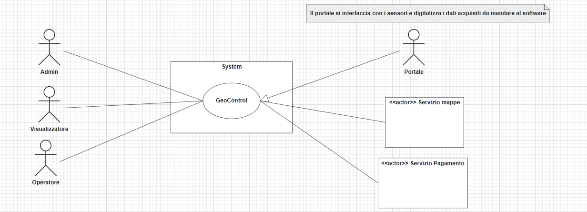
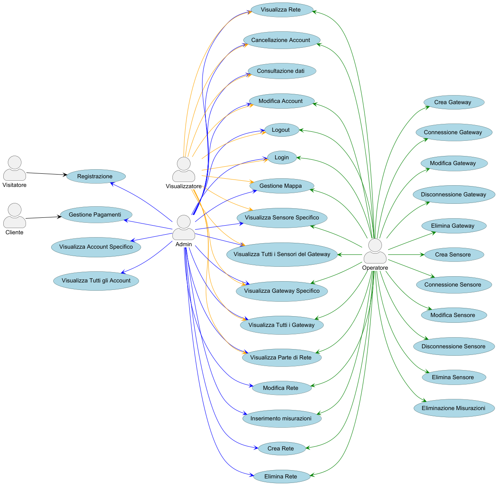
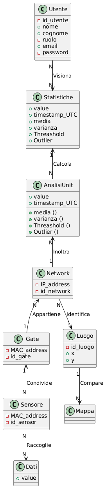
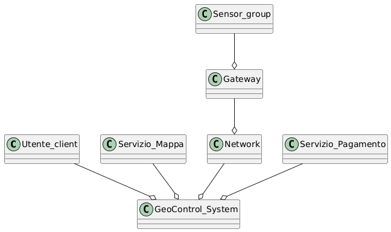

# Requirements Document - GeoControl

Date:

Version: V1 - description of Geocontrol as described in the swagger

| Version number |                                                     Change                                                      |
| :------------: | :-------------------------------------------------------------------------------------------------------------: |
|      V1.1      |                                     Definizione Stakeholder - Luca Amoroso                                      |
|      V1.2      |            Definizione Attori, Interfacce, Context Diagram e Stories And Personas - Jacopo Esposito             |
|      V1.3      |                             Definizione Business Model - Elia Cola, Jacopo Esposito                             |
|      V1.4      | Definizione Requisiti Funzionali e Non Funzionali - Andrea Garnerone, Luca Amoroso, Elia Cola |
|      V1.5      |                       Definizine Use case - Andrea Garnerone, Elia Cola, Jacopo Esposito                        |
|      V1.6      |                                Definizione use case Diagram  - Andrea Garnerone                                 |
|      V1.7      |                                 Definizione Sequence Diagram - Andrea Garnerone                                 |
|      V1.8      |                     Definizione Glossary, System Design e Deployment Diagram - Luca Amoroso                     |
|      V1.9      |                                   Estimation - Luca Amoroso e Jacopo Esposito                                   |
|     V1.10      |             Correzione e supervisione - Elia Cola, Andrea Garnerone, Luca Amoroso, Jacopo Esposito              |

# Contents

- [Requirements Document - GeoControl](#requirements-document---geocontrol)
- [Contents](#contents)
- [Informal description](#informal-description)
- [Business Model](#business-model)
    - [Licenza Base](#licenza-base)
    - [Implementazioni Personalizzate](#implementazioni-personalizzate)
    - [Servizi di Manutenzione e Aggiornamento](#servizi-di-manutenzione-e-aggiornamento)
- [Stakeholders](#stakeholders)
- [Context Diagram and interfaces](#context-diagram-and-interfaces)
  - [Context Diagram](#context-diagram)
  - [Interfaces](#interfaces)
- [Stories and personas](#stories-and-personas)
    - [1. Roberto – Direttore Tecnico dell’Ente Pubblico](#1-roberto--direttore-tecnico-dellente-pubblico)
    - [2. Carla – Responsabile Ambientale di un’Agenzia Privata](#2-carla--responsabile-ambientale-di-unagenzia-privata)
    - [3. Marco – Amministratore IT di un Comune](#3-marco--amministratore-it-di-un-comune)
    - [4. Giulia – Manager di una Società di Manutenzione per Edifici Storici](#4-giulia--manager-di-una-società-di-manutenzione-per-edifici-storici)
    - [5. Andrea – Responsabile di Sistema GeoControl (Admin)](#5-andrea--responsabile-di-sistema-geocontrol-admin)
    - [6. Federico – Tecnico di Campo di GeoControl (Operator)](#6-federico--tecnico-di-campo-di-geocontrol-operator)
    - [7. Elena – Data Analyst per GeoControl](#7-elena--data-analyst-per-geocontrol)
- [Functional and non functional requirements](#functional-and-non-functional-requirements)
  - [Functional Requirements](#functional-requirements)
  - [Non Functional Requirements](#non-functional-requirements)
- [Use case diagram and use cases](#use-case-diagram-and-use-cases)
  - [Use case diagram](#use-case-diagram)
    - [Use case 1, UC1 Login](#use-case-1-uc1-login)
        - [Scenario 1.1](#scenario-11)
        - [Scenario 1.2](#scenario-12)
        - [Scenario 1.3](#scenario-13)
        - [Scenario 1.4](#scenario-14)
    - [Use case 2, UC2 Logout](#use-case-2-uc2-logout)
        - [Scenario 2.1](#scenario-21)
    - [Use case 3, UC3 Registrazione](#use-case-3-uc3-registrazione)
      - [Scenario 3.1](#scenario-31)
      - [Scenario 3.2](#scenario-32)
      - [Scenario 3.3](#scenario-33)
      - [Scenario 3.4](#scenario-34)
      - [Scenario 3.5](#scenario-35)
    - [Use case 4, UC4 Modifica Account](#use-case-4-uc4-modifica-account)
      - [Scenario 4.1](#scenario-41)
      - [Scenario 4.2](#scenario-42)
      - [Scenario 4.3](#scenario-43)
    - [Use case 5, UC5 Cancellazione Account](#use-case-5-uc5-cancellazione-account)
      - [Scenario 5.1](#scenario-51)
      - [Scenario 5.2](#scenario-52)
      - [Scenario 5.3](#scenario-53)
    - [Use case 6, UC6 Visualizzazione di tutti gli Account](#use-case-6-uc6-visualizzazione-di-tutti-gli-account)
        - [Scenario 6.1](#scenario-61)
    - [Use case 7, UC7 Visualizzazione di uno specifico Account](#use-case-7-uc7-visualizzazione-di-uno-specifico-account)
        - [Scenario 7.1](#scenario-71)
        - [Scenario 7.2](#scenario-72)
    - [Use case 8, UC8 Creazione Rete](#use-case-8-uc8-creazione-rete)
      - [Scenario 8.1](#scenario-81)
      - [Scenario 8.2](#scenario-82)
      - [Scenario 8.3](#scenario-83)
      - [Scenario 8.4](#scenario-84)
    - [Use case 9, UC9 Modifica Rete](#use-case-9-uc9-modifica-rete)
      - [Scenario 9.1](#scenario-91)
      - [Scenario 9.2](#scenario-92)
      - [Scenario 9.3](#scenario-93)
    - [Use case 10, UC10 Eliminazione Rete](#use-case-10-uc10-eliminazione-rete)
      - [Scenario 10.1](#scenario-101)
      - [Scenario 10.2](#scenario-102)
      - [Scenario 10.3](#scenario-103)
    - [Use case 11, UC11 Visualizzazione di tutta la Rete](#use-case-11-uc11-visualizzazione-di-tutta-la-rete)
        - [Scenario 11.1](#scenario-111)
    - [Use case 12, UC12 Visualizzazione di una parte della rete](#use-case-12-uc12-visualizzazione-di-una-parte-della-rete)
        - [Scenario 12.1](#scenario-121)
        - [Scenario 12.2](#scenario-122)
    - [Use case 13, UC13 Creazione Gateway](#use-case-13-uc13-creazione-gateway)
      - [Scenario 13.1](#scenario-131)
      - [Scenario 13.2](#scenario-132)
      - [Scenario 13.3](#scenario-133)
    - [Use case 14, UC14 Connessione Gateway](#use-case-14-uc14-connessione-gateway)
      - [Scenario 14.1](#scenario-141)
      - [Scenario 14.2](#scenario-142)
      - [Scenario 14.3](#scenario-143)
    - [Use case 15, UC15 Aggiornamento Gateway](#use-case-15-uc15-aggiornamento-gateway)
      - [Scenario 15.1](#scenario-151)
      - [Scenario 15.2](#scenario-152)
    - [Use case 16, UC16 Disconnessione Gateway](#use-case-16-uc16-disconnessione-gateway)
      - [Scenario 16.1](#scenario-161)
      - [Scenario 16.2](#scenario-162)
      - [Scenario 16.3](#scenario-163)
    - [Use case 17, UC17 Eliminazione Gateway](#use-case-17-uc17-eliminazione-gateway)
      - [Scenario 17.1](#scenario-171)
      - [Scenario 17.2](#scenario-172)
    - [Use case 18, UC18 Visualizzazione di tutti i Gateway](#use-case-18-uc18-visualizzazione-di-tutti-i-gateway)
        - [Scenario 18.1](#scenario-181)
    - [Use case 19, UC19 Visualizzazione di un singolo Gateway](#use-case-19-uc19-visualizzazione-di-un-singolo-gateway)
        - [Scenario 19.1](#scenario-191)
        - [Scenario 19.2](#scenario-192)
    - [Use case 20, UC20 Creazione Sensore](#use-case-20-uc20-creazione-sensore)
      - [Scenario 20.1](#scenario-201)
      - [Scenario 20.2](#scenario-202)
      - [Scenario 20.3](#scenario-203)
    - [Use case 21, UC21 Connessione Sensore](#use-case-21-uc21-connessione-sensore)
      - [Scenario 21.1](#scenario-211)
      - [Scenario 21.2](#scenario-212)
      - [Scenario 21.3](#scenario-213)
    - [Use case 22, UC22 Aggiornamento Sensore](#use-case-22-uc22-aggiornamento-sensore)
      - [Scenario 22.1](#scenario-221)
      - [Scenario 22.2](#scenario-222)
    - [Use case 23, UC23 Disconnessione Sensore](#use-case-23-uc23-disconnessione-sensore)
      - [Scenario 23.1](#scenario-231)
      - [Scenario 23.2](#scenario-232)
      - [Scenario 23.3](#scenario-233)
    - [Use case 24, UC24 Eliminazione Sensore](#use-case-24-uc24-eliminazione-sensore)
      - [Scenario 24.1](#scenario-241)
      - [Scenario 24.2](#scenario-242)
    - [Use case 25, UC25 Visualizzazione di tutti i Sensori di un Gateway](#use-case-25-uc25-visualizzazione-di-tutti-i-sensori-di-un-gateway)
        - [Scenario 25.1](#scenario-251)
        - [Scenario 25.2](#scenario-252)
    - [Use case 26, UC26 Visualizzazione di un singolo Sensore](#use-case-26-uc26-visualizzazione-di-un-singolo-sensore)
        - [Scenario 26.1](#scenario-261)
        - [Scenario 26.2](#scenario-262)
    - [Use Case 27, UC27 Gestione Mappa e Interfacce Visive](#use-case-27-uc27-gestione-mappa-e-interfacce-visive)
        - [Scenario 27.1](#scenario-271)
        - [Scenario 27.2](#scenario-272)
        - [Scenario 27.3](#scenario-273)
    - [Use case 28, UC28 Gestione Pagamenti](#use-case-28-uc28-gestione-pagamenti)
        - [Scenario 28.1](#scenario-281)
        - [Scenario 28.2](#scenario-282)
        - [Scenario 28.3](#scenario-283)
    - [Use Case 29, UC29 Inserimento Misurazioni](#use-case-29-uc29-inserimento-misurazioni)
        - [Scenario 29.1](#scenario-291)
        - [Scenario 29.2](#scenario-292)
        - [Scenario 29.3](#scenario-293)
        - [Scenario 29.4](#scenario-294)
        - [Scenario 29.5](#scenario-295)
    - [Use case 30, UC30 Eliminazione Misurazioni](#use-case-30-uc30-eliminazione-misurazioni)
      - [Scenario 30.1](#scenario-301)
      - [Scenario 30.2](#scenario-302)
    - [Use case 31, UC31 – Consultazione Dati](#use-case-31-uc31--consultazione-dati)
      - [Scenario 31.1](#scenario-311)
      - [Scenario 31.2](#scenario-312)
      - [Scenario 31.3](#scenario-313)
      - [Scenario 31.4](#scenario-314)
      - [Scenario 31.5](#scenario-315)
- [Glossary](#glossary)
- [System Design](#system-design)
- [Deployment Diagram](#deployment-diagram)

# Informal description

GeoControl is a software system designed for monitoring physical and environmental variables in various contexts: from hydrogeological analysis of mountain areas to the surveillance of historical buildings, and even the control of internal parameters (such as temperature or lighting) in residential or working environments.

# Business Model

L'azienda si occupa dello sviluppo del software **GeoControl**, inizialmente commissionato e finanziato in via esclusiva dall'ente _"L'Unione delle Comunità Montane del Piemonte"_. Questa fase iniziale ha permesso di realizzare un prodotto solido, in grado di monitorare e gestire in modo accurato le misurazioni provenienti dai sensori distribuiti sul territorio, garantendo la precisione e la continuità dei dati rilevati.

Successivamente, l'azienda ha deciso di estendere la propria offerta rendendo GeoControl disponibile ad altri enti e aziende, sia pubblici che privati. La strategia commerciale prevede:

### Licenza Base

Il software viene reso accessibile attraverso la vendita di una **licenza base**, che consente ai clienti di usufruire delle funzionalità native e core del sistema. Questa licenza permette di accedere a tutti i moduli fondamentali per la gestione, il monitoraggio e l’analisi dei dati provenienti dai sensori.

### Implementazioni Personalizzate

L'azienda offre, su richiesta, la possibilità di sviluppare **funzionalità aggiuntive e personalizzate**. Queste implementazioni, realizzate in base alle specifiche esigenze del singolo cliente, costituiscono un valore aggiunto al prodotto di base. Una volta sviluppate, tali funzionalità potranno essere rese disponibili ad altri utenti attraverso un **modello di abbonamento mensile**, ampliando così il ventaglio di soluzioni offerte.

### Servizi di Manutenzione e Aggiornamento

Al fine di garantire la massima **affidabilità** e la **consistenza dei dati**, l’azienda propone servizi continuativi di manutenzione e aggiornamento del software. Questi servizi mirano a ottimizzare la raccolta e l’elaborazione dei dati, assicurando che il sistema risponda in modo tempestivo alle esigenze operative e alle evoluzioni tecnologiche del settore.

---

In sintesi, il modello di business di **GeoControl** si fonda su una combinazione di entrate derivanti dalla:

- vendita di **licenze base**
- fornitura di **soluzioni personalizzate su commissione**
- offerta di **servizi ricorrenti** di manutenzione e aggiornamento

Questo approccio permette di coniugare la sostenibilità economica iniziale, assicurata dal finanziamento dell'ente committente, con una strategia di espansione commerciale orientata a soddisfare le esigenze di una clientela diversificata e in continua evoluzione.

# Stakeholders

|              Stakeholder name              |                              Description                               |
| :----------------------------------------: | :--------------------------------------------------------------------: |
|          Enti pubblici e privati           |                     Enti utilizzatori del servizio                     |
| Unione delle Comunità Montane del Piemonte |                            Ente committente                            |
|             Agenzie Ambientali             |        Condividono i dati sui territori o sugli edifici storici        |
|             Fornitori Sensori              |    Forniscono l'hardware necessario per estrarre dati sull'ambiente    |
|               Servizio Mappe               |            Fornisce le mappe per visualizzare gli ambienti             |
|             Servizio Pagamento             | Fornisce i metodi di pagamento per il la licenza e per gli abbonamenti |
|               Inside Company               |            Software developer e analisti dei dati estratti             |

# Context Diagram and interfaces

## Context Diagram

## Interfaces

|         Actor         |                   Logical Interface                   |   Physical Interface    |
| :-------------------: | :---------------------------------------------------: | :---------------------: |
|         Admin         |                          GUI                          |           PC            |
|       Operatore       |                          GUI                          |     Smartphone / PC     |
|    Visualizzatore     |                          GUI                          |     Smartphone / PC     |
|        Sensori        |         interaction through sensor detection          |    sensor and camera    |
|    Servizio Mappe     | API per ricevere un area su cui effettuare le analisi | Connsessione a Internet |
| Servizio di Pagamento | API per la gestione dei pagamenti e degli abbonamenti | Connessione a internet  |

# Stories and personas

### 1. Roberto – Direttore Tecnico dell’Ente Pubblico
- **Ruolo e Responsabilità:**  
  Responsabile della gestione tecnica e della manutenzione delle infrastrutture pubbliche regionali, con particolare attenzione alla prevenzione dei rischi idrogeologici.
- **Bisogni:**  
  - Sistema affidabile che minimizzi la perdita dei dati (massimo 6 misurazioni all’anno per sensore).  
  - Gestione centralizzata e aggiornata delle reti e dei dispositivi.  
  - Strumenti di analisi in tempo reale per decisioni rapide in caso di anomalie.
- **Motivazioni:**  
  Cerca soluzioni innovative che garantiscano sicurezza e continuità nel monitoraggio, ottimizzando i costi di manutenzione e permettendo interventi tempestivi.

---

### 2. Carla – Responsabile Ambientale di un’Agenzia Privata
- **Ruolo e Responsabilità:**  
  Gestisce i progetti di monitoraggio ambientale, collaborando con enti pubblici e privati per la raccolta e l’analisi dei dati.
- **Bisogni:**  
  - Interfaccia intuitiva, accessibile sia da dispositivi mobili che da PC.  
  - Report dettagliati e personalizzabili, con grafici, statistiche e trend storici.  
  - Integrazione con altri sistemi (es. mappe).
- **Motivazioni:**  
  Desidera un sistema che faciliti la raccolta dati in tempo reale, riducendo i tempi di intervento e migliorando la precisione delle analisi ambientali.

---

### 3. Marco – Amministratore IT di un Comune
- **Ruolo e Responsabilità:**  
  Responsabile dell’infrastruttura tecnologica comunale, garantendo sicurezza, aggiornamento e gestione delle soluzioni digitali per il monitoraggio territoriale.
- **Bisogni:**  
  - Sistema facile da integrare e configurare per reti, gateway e sensori.  
  - Processo di autenticazione e gestione utenti robusto e sicuro.  
  - Funzionalità che permettano aggiornamenti rapidi e personalizzati in base alle esigenze locali.
- **Motivazioni:**  
  Cerca soluzioni scalabili e affidabili che semplifichino la gestione dei dispositivi sul territorio, assicurando continuità operativa e facilitando una gestione smart della città.

---

### 4. Giulia – Manager di una Società di Manutenzione per Edifici Storici
- **Ruolo e Responsabilità:**  
  Coordina il monitoraggio e la manutenzione degli edifici storici, garantendo il controllo dei parametri ambientali per la conservazione.
- **Bisogni:**  
  - Sistema modulare e flessibile, capace di adattarsi a diverse tipologie di ambienti.  
  - Notifiche e report in tempo reale per intervenire immediatamente in caso di anomalie.  
  - Interfaccia semplice e intuitiva, fruibile anche da personale non tecnico.
- **Motivazioni:**  
  Vuole proteggere gli edifici storici e prevenire danni legati a variazioni ambientali, con informazioni chiare e tempestive per programmare interventi di manutenzione mirati.

---

### 5. Andrea – Responsabile di Sistema GeoControl (Admin)
- **Ruolo e Responsabilità:**  
  Si occupa della configurazione, dell’aggiornamento e della gestione operativa del sistema GeoControl all’interno dell’organizzazione.Ha pieno controllo di tutte le risorse inclusi gli utenti e le reti
- **Motivazioni:**  
  Punta a garantire la massima affidabilità e sicurezza del sistema, riducendo il tempo di inattività e semplificando la manutenzione, per offrire un servizio sempre allineato alle esigenze dell’organizzazione.

---

### 6. Federico – Tecnico di Campo di GeoControl (Operator)
- **Ruolo e Responsabilità:**  
  Incaricato di monitorare i dati in tempo reale e di intervenire in caso di intallazioni di rete o anomalie segnalate dai sensori.
- **Motivazioni:**  
  Desidera ridurre il carico operativo grazie a strumenti che lo aiutino a identificare e risolvere rapidamente eventuali malfunzionamenti, garantendo così il corretto funzionamento del sistema sul campo.

---

### 7. Elena – Data Analyst per GeoControl
- **Ruolo e Responsabilità:** 
Analizza i dati raccolti dalla rete GeoControl per produrre report, indicatori di rischio e modelli di previsione a supporto delle decisioni che ciascun ente intende prendere. Collabora con tecnici di progetto e dirigenti per trasformare i dati grezzi in statistiche utili al fine di fornire dati per la valutazione di azioni contro i rischi idrogeologici o simili.
- **Bisogni:** 
Accesso a dati completi, validati e storicizzati, anche tramite API o strumenti di esportazione.
Filtri avanzati di visualizzazione e gestione dei dati (per area geografica, Gateway, Network , periodo ecc...).
Strumenti di analisi statistica e generazione di grafici e report personalizzati in base al bisogno del cliente.
- **Motivazioni:** 
Vuole ottimizzare i processi di analisi ambientale trasformando grandi volumi di misurazioni real time in informazioni affidabili e tempestive. Inoltre necessita di uno strumento ottimizzato che favorisca la condivisione dei risultati con formattazione predefinita o modulabile con altri uffici e consenta analisi predittive basate su analisi dei dati storici.

# Functional and non functional requirements

## Functional Requirements

|    ID    |                                           Description                                            |
| :------: | :----------------------------------------------------------------------------------------------: |
| **FR1**  |                                          Autenticazione                                          |
|  FR 1.1  |                                          Log in/Log out                                          |
|  FR 1.2  |                   Differenziazione account (visualizzatore, operatore, admin)                    |
|  FR 1.3  |                                         Gestione account                                         |
| FR 1.3.1 |                                      Registrazione account                                       |
| FR 1.3.2 |                                         Modifica account                                         |
| FR 1.3.3 |                                       Eliminazione account                                       |
|  FR 1.4  |                                 Autenticazione tramite token JWT                                 |
|  FR 1.5  |                                     Visualizzazione account                                      |
| **FR2**  |                                          Gestione reti                                           |
|  FR 2.1  |                                Creazione reti, gateway e sensori                                 |
|  FR 2.2  |                                 Modifica reti, gateway e sensori                                 |
|  FR 2.3  |                             Eliminazione di reti, gateway e sensori                              |
|  FR 2.4  | Identificazione univoca degli elementi (codici per network, indirizzi MAC per gateway e sensori) |
|  FR 2.5  |                             Visualizzazione rete, gateway, e sensori                             |
| **FR3**  |                                          Gestione Mappa                                          |
|  FR 3.1  |                                 Chiedere accesso alla posizione                                  |
|  FR 3.2  |                                        Mostrare la mappa                                         |
|  FR 3.3  |                                Gestione edifici storici e luoghi                                 |
|  FR 3.4  |                             Mostrare icona edificio storico o luogo                              |
| **FR4**  |                                    Gestione delle misurazioni                                    |
|  FR 4.1  |                                  Inserimento delle misurazioni                                   |
|  FR 4.2  |                                    Modifica delle misurazioni                                    |
|  FR 4.3  |                                  Eliminazione delle misurazioni                                  |
|  FR 4.4  |                                Visualizzazione delle misurazioni                                 |
|  FR 4.5  |                           Conversione timestamp (from ISO8061 to UTC)                            |
|  FR 4.6  |                       Conversione digitale dei valori forniti dai sensori                        |
| **FR5**  |                                           Analisi Dati                                           |
|  FR 5.1  |                                       Calcolo statistiche                                        |
| FR 5.1.1 |                                            Media (μ)                                             |
| FR 5.1.2 |                                          varianza (σ²)                                           |
| FR 5.1.3 |                                  Soglie (superiore e inferiore)                                  |
| FR 5.1.4 |                                          Valore anomalo                                          |
|  FR 5.2  |                                    Controllo correttezza dati                                    |
| **FR6**  |                                    Gestione notitica di alert                                    |
|  FR 6.1  |                                        Invio e ricezione                                         |
|  FR 6.2  |                                 Lettura dati anomali da notifica                                 |
| **FR7**  |                                        Gestione pagamenti                                        |
|  FR 7.1  |                                  Fornitori Servizi di pagamento                                  |
|  FR 7.2  |                                 Definizione livelli di pagamento                                 |
|  FR 7.3  |                                        Gestione rimborsi                                         |
|  FR 7.4  |                                   Gestione metodi di pagamento                                   |
|  FR 7.5  |                       Gestione autorizzazioni di pagamento in tempo reale                        |

## Non Functional Requirements

|  ID   |     Type      |                                                              Description                                                               |  Refers to   |
| :---: | :-----------: | :------------------------------------------------------------------------------------------------------------------------------------: | :----------: |
| NFR1  | Affidabilità  |       - Non avere più di 6 misurazioni perse all’anno   - Assicurare la disponibilità di dati critici in tutte le situazioni        |     FR4      |
| NFR2  |    Dominio    | - Unità di misura dei valori dei sensori (esempio conversioni timestamp – date)   - Espressione chiara dei valori delle statistiche | FR4.2- FR4.1 |
| NFR3  |  Efficienza   |             - I dati devono essere forniti in tempo reale senza latenza   -  Caricamento mappa e dati in pochi secondi              | FR4.4 - FR3  |
| NFR4  |   Usabilità   |                                      L’app deve essere utilizzabile in modo intuitivo e semplice                                       |    Tutti     |
| NFR5  | Manutenzione  |                     - Codice modulare e facilmente implementabile   Tenere traccia dei cambiamenti e dei moduli                     |    Tutti     |
| NFR6  |  Portabilità  |                              Sistema utilizzabile su browser diversi  e dispositivi mobili di vario tipo                               |    Tutti     |
| NFR7  |    Lingua     |                                                 - Italiano   - Inglese (opzionale)                                                  |    Tutti     |
| NFR8  | Compatibilità |                                               - Servizi mappe   -Srvizi di pagamento                                                |   FR3-FR7    |
| NFR10 |  Modularità   |                Il sistema deve supportare un numero crescente di sensori e utenti senza degradamento delle performance                 |    Tutti     |

# Use case diagram and use cases

## Use case diagram

### Use case 1, UC1 Login

| Actors Involved  | Admin, Operatore, Visualizzatore (Chiamati Utente) |
| :--------------: | :------------------------------------------------: |
|   Precondition   |             L'utente non è autenticato             |
|  Post condition  |            L'utente è stato autenticato            |
| Nominal Scenario |                    Scenario 1.1                    |
|     Variants     |                        None                        |
|    Exceptions    |               Scenario 1.2, 1.3, 1.4               |

##### Scenario 1.1

|  Scenario 1.1  |                         Login con credenziali corrette                         |
| :------------: | :----------------------------------------------------------------------------: |
|  Precondition  |                             Utente non autenticato                             |
| Post condition |                          Utente loggato correttamente                          |
|     Step#      |                                  Descrizione                                   |
|       1        |                        Sistema: chiede email e password                        |
|       2        |                       Utente: inserisce email e password                       |
|       3        | Sistema: legge email e password, controlla se l'utente è già loggato, non lo è |
|       4        |                 Sistema: trova l'utente a partire dallo email                  |
|       5        |        Sistema: recupera la password, la confronta con quella inserita         |
|       6        |         Sistema: password uguali, viene generato e condiviso il token          |
|       7        |             Sistema: utente autorizzato e loggato. Avvio sessione              |

##### Scenario 1.2
|  Scenario 1.2  |                                         Login con password errata                                         |
| :------------: | :-------------------------------------------------------------------------------------------------------: |
|  Precondition  |                                          Utente non autenticato                                           |
| Post condition |                                            Utente non loggato                                             |
|     Step#      |                                                Descrizione                                                |
|       1        |                                     Sistema: chiede email e password                                      |
|       2        |                                    Utente: inserisce email e password                                     |
|       3        |              Sistema: legge email e password, controlla se l'utente è gia loggato, non lo è               |
|       4        |                               Sistema: trova l'utente a partire dallo email                               |
|       5        | Sistema: recupera la password, confronta con quella inserita. Password non uguali, utente non autorizzato |
|       6        |                                    Sistema: mostra messaggio d'errore                                     |

##### Scenario 1.3
|  Scenario 1.3  |                            Login con utente inesistente                             |
| :------------: | :---------------------------------------------------------------------------------: |
|  Precondition  |                               Utente non autenticato                                |
| Post condition |                               Utente non autenticato                                |
|     Step#      |                                     Descrizione                                     |
|       1        |                          Sistema: chiede email e password                           |
|       2        |                         Utente: inserisce email e password                          |
|       3        |   Sistema: legge email e password, controlla se l'utente è gia loggato, non lo è    |
|       4        | Sistema: trova l'utente a partire dallo email. Utente non trovato e non autorizzato |
|       5        |                         Sistema: mostra messaggio d'errore                          |

##### Scenario 1.4
|  Scenario 1.4  |                        Login con utente gia loggato                        |
| :------------: | :------------------------------------------------------------------------: |
|  Precondition  |                           Utente non autenticato                           |
| Post condition |                             Utente non loggato                             |
|     Step#      |                                Descrizione                                 |
|       1        |                      Sistema: chiede email e password                      |
|       2        |                     Utente: inserisce email e password                     |
|       3        | Sistema: legge email e password, controlla se l'utente è gia loggato, lo è |
|       4        |                     Sistema: mostra messaggio d'errore                     |

### Use case 2, UC2 Logout
| Actors Involved  | Admin, Operatore, Visualizzatore, chiamati generalmente Utente |
| :--------------: | :------------------------------------------------------------: |
|   Precondition   |                     L'utente è autenticato                     |
|  Post condition  |                 L'utente non è più autenticato                 |
| Nominal Scenario |                          Scenario 2.1                          |
|     Variants     |                              None                              |
|    Exceptions    |                              None                              |

##### Scenario 2.1
|  Scenario 2.1  |                       Logout con utente gia loggato                       |
| :------------: | :-----------------------------------------------------------------------: |
|  Precondition  |                              Utente loggato                               |
| Post condition |          Utente non più loggato non ha accesso alla piattaforma           |
|     Step#      |                                Descrizione                                |
|       1        |                        Utente: richiede il logout                         |
|       2        |             Sistema: verifica che l'utente sia loggato, lo è              |
|       3        | Sistema: invalida la sessione corrente dal dispositivo attualmente in uso |
|       3        |            Sistema: Riporta l'utente non loggato alla homepage            |

### Use case 3, UC3 Registrazione

| Actors Involved  |      Visitatore, Admin       |
| ---------------- | :--------------------------: |
| Precondition     | Visitatore non ha un account |
| Post condition   |        Account creato        |
| Nominal Scenario |         Scenario 3.1         |
| Variants         |         Scenario 3.4         |
| Exceptions       |    Scenario 3.3, 3.2, 3.5    |

#### Scenario 3.1 

| Scenario 3.1   |                                       Registrazione di un nuovo account di qualsiasi tipo                                        |
| -------------- | :------------------------------------------------------------------------------------------------------------------------------: |
| Precondition   |                                                   Visitatore non ha un account                                                   |
| Post condition |                                                         User registrato                                                          |
| Step#          |                                                           Descrizione                                                            |
| 1              |                                      Sistema:  Chiede email, nome, cognome, ruolo, password                                      |
| 2              |                                    Visitatore: Fornisce email, nome, cognome, ruolo, password                                    |
| 3              |                                       Sistema: Legge email, nome, cognome, ruolo, password                                       |
| 4              |                            Sistema: Verifica che i campi obbligatori non siano vuoti, non sono vuoti                             |
| 5              | Sistema: Controlla che l'email fornita dallo User non sia associato a un account già esistente. L'email non è ancora stata usata |
| 6              |                                                  Sistema: Legge un campo ruolo                                                   |
| 7              |                                  Sistema: Crea un nuovo account e registra le sue informazioni                                   |

#### Scenario 3.2 

| Scenario 3.2   |                                             Registrazione con email già esistente                                              |
| -------------- | :----------------------------------------------------------------------------------------------------------------------------: |
| Precondition   |                                 Visitatore vuole registrarsi, email già presente nel database                                  |
| Post condition |                                                     Registrazione fallita                                                      |
| Step#          |                                                          Descrizione                                                           |
| 1              |                                     Sistema:  Chiede email, nome, cognome, ruolo, password                                     |
| 2              |                                   Visitatore: Fornisce email, nome, cognome, ruolo, password                                   |
| 3              |                                      Sistema: Legge email, nome, cognome, ruolo, password                                      |
| 4              |                           Sistema: Verifica che i campi obbligatori non siano vuoti, non sono vuoti                            |
| 5              | Sistema:  Controlla che l'email fornita dal visitatore non sia associato a un account già esistente. L'email è già utilizzata. |
| 6              |                                           Sistema: Mostra un messaggio di errore 409                                           |

#### Scenario 3.3 

| Scenario 3.3   |                  Registrazione con campo obbligatorio vuoto                   |
| -------------- | :---------------------------------------------------------------------------: |
| Precondition   |                         Visitatore vuole registrarsi                          |
| Post condition |                             Registrazione fallita                             |
| Step#          |                                  Descrizione                                  |
| 1              |                    Visitatore: Richiesta di registrazione                     |
| 2              |            Sistema:  Chiede email, nome, cognome, ruolo, password             |
| 3              |          Visitatore: Fornisce email, nome, cognome, ruolo, password           |
| 4              |             Sistema: Legge email, nome, cognome, ruolo, password              |
| 5              | Sistema: Verifica che i campi obbligatori non siano vuoti, almeno uno è vuoto |
| 6              |                    Sistema: Mostra un messaggio di errore                     |

#### Scenario 3.4 

| Scenario 3.4   |             Registrazione di un nuovo utente da parte dell'Admin              |
| -------------- | :---------------------------------------------------------------------------: |
| Precondition   |                         Visitatore vuole registrarsi                          |
| Post condition |                             Registrazione fallita                             |
| Step#          |                                  Descrizione                                  |
| 1              |                    Visitatore: Richiesta di registrazione                     |
| 2              |            Sistema:  Chiede email, nome, cognome, ruolo, password             |
| 3              |          Visitatore: Fornisce email, nome, cognome, ruolo, password           |
| 4              |             Sistema: Legge email, nome, cognome, ruolo, password              |
| 5              | Sistema: Verifica che i campi obbligatori non siano vuoti, almeno uno è vuoto |
| 6              |                    Sistema: Mostra un messaggio di errore                     |

#### Scenario 3.5 

| Scenario 3.5   |              Registrazione con valore di un campo non valido              |
| -------------- | :-----------------------------------------------------------------------: |
| Precondition   |                       Visitatore vuole registrarsi                        |
| Post condition |                           Registrazione fallita                           |
| Step#          |                                Descrizione                                |
| 1              |                  Visitatore: Richiesta di registrazione                   |
| 2              |          Sistema:  Chiede email, nome, cognome, ruolo, password           |
| 3              |        Visitatore: Fornisce email, nome, cognome, ruolo, password         |
| 4              |           Sistema: Legge email, nome, cognome, ruolo, password            |
| 5              | Sistema: Verifica che i campi abbiano valori validi , almeno uno non lo è |
| 6              |                  Sistema: Mostra un messaggio di errore                   |

### Use case 4, UC4 Modifica Account

| Actors Involved  |          Tutti gli utenti registrati          |
| ---------------- | :-------------------------------------------: |
| Precondition     | Utente registrato che vuole cambiare dei dati |
| Post condition   |              Account modificato               |
| Nominal Scenario |                 Scenario 4.1                  |
| Variants         |                 Scenario 4.3                  |
| Exceptions       |                 Scenario 4.2                  |

#### Scenario 4.1 

| Scenario 4.1   |            Modifica di un account da parte di un utente            |
| -------------- | :----------------------------------------------------------------: |
| Precondition   |               Utente vuole modificare il suo account               |
| Post condition |                        Modifica effettuata                         |
| Step#          |                            Descrizione                             |
| 1              |             Utente: Richiesta di modificare l'account              |
| 2              |          Sistema: Chiede quale campo si vuole modificare           |
| 3              |           Utente: Fornisce il campo che vuole modificare           |
| 4              |             Sistema: Chiede il nuovo valore all'utente             |
| 5              | Sistema: Verifica che il nuovo valore da inserire sia valido, lo è |
| 6              |  Sistema: Mostra un messaggio di modifica effettuata con successo  |

#### Scenario 4.2

| Scenario 4.2   |              Modifica di un account con valore non valido              |
| -------------- | :--------------------------------------------------------------------: |
| Precondition   |                 Utente vuole modificare il suo account                 |
| Post condition |                        Modifica non effettuata                         |
| Step#          |                              Descrizione                               |
| 1              |               Utente: Richiesta di modificare l'account                |
| 2              |            Sistema: Chiede quale campo si vuole modificare             |
| 3              |             Utente: Fornisce il campo che vuole modificare             |
| 4              |               Sistema: Chiede il nuovo valore all'utente               |
| 5              | Sistema: Verifica che il nuovo valore da inserire sia valido, non lo è |
| 6              |                 Sistema: Mostra un messaggio di errore                 |

#### Scenario 4.3

| Scenario 4.3   |            Modifica di un account da parte dell' Admin             |
| -------------- | :----------------------------------------------------------------: |
| Precondition   |                 Admin vuole modificare un account                  |
| Post condition |                        Modifica  effettuata                        |
| Step#          |                            Descrizione                             |
| 1              |             Admin: Richiesta di modificare un account              |
| 2              |          Sistema: Chiede quale campo si vuole modificare           |
| 3              |           Admin: Fornisce il campo che vuole modificare            |
| 4              |             Sistema: Chiede il nuovo valore all'Admin              |
| 5              | Sistema: Verifica che il nuovo valore da inserire sia valido, lo è |
| 6              |  Sistema: Mostra un messaggio di modifica effettuata con successo  |

### Use case 5, UC5 Cancellazione Account

| Actors Involved  |             Tutti gli utenti registrati              |
| ---------------- | :--------------------------------------------------: |
| Precondition     | utente registrato che vuole eliminare il suo account |
| Post condition   |                  Account cancellato                  |
| Nominal Scenario |                     Scenario 5.1                     |
| Variants         |                     Scenario 5.3                     |
| Exceptions       |                     Scenario 5.2                     |

#### Scenario 5.1

| Scenario 5.1   |                                 Utente elimina il proprio account                                 |
| -------------- | :-----------------------------------------------------------------------------------------------: |
| Precondition   |                                  Utente ha un account registrato                                  |
| Post condition |                                 Utente elimina il proprio account                                 |
| Step#          |                                            Descrizione                                            |
| 1              |                         Utente: Chiede l'eliminazione del proprio account                         |
| 2              |                      Sistema: Chiede all'Utente una conferma di eliminazione                      |
| 3              |                                   Utente: Conferma eliminazione                                   |
| 4              | Sistema: Elimina l'account dell'Utente, Utente non è più connesso e riportato alla schermata home |

#### Scenario 5.2

| Scenario 5.2   | Utente elimina il proprio account, eliminazione annullata |
| -------------- | :-------------------------------------------------------: |
| Precondition   |              Utente ha un account registrato              |
| Post condition |                  Eliminazione annullata                   |
| Step#          |                        Descrizione                        |
| 1              |     Utente: Chiede l'eliminazione del proprio account     |
| 2              |  Sistema: Chiede all'Utente una conferma di eliminazione  |
| 3              |               Utente: Annulla eliminazione                |
| 4              |            Sistema: Mostra profilo dell'utente            |

#### Scenario 5.3

| Scenario 5.3   |           Eliminazione di un account da parte dell' Admin            |
| -------------- | :------------------------------------------------------------------: |
| Precondition   |                   Admin vuole eliminare un account                   |
| Post condition |                       Eliminazione  effettuata                       |
| Step#          |                             Descrizione                              |
| 1              |            Admin: Richiesta di eliminazione di un account            |
| 2              |           Sistema: Chiede quale account si vuole eliminare           |
| 3              |      Admin: Fornisce l'email dell'account che vuole modificare       |
| 4              | Sistema: Mostra un messaggio di eliminazione effettuata con successo |

### Use case 6, UC6 Visualizzazione di tutti gli Account
| Actors Involved  |                                 Admin                                 |
| ---------------- | :-------------------------------------------------------------------: |
| Precondition     | Richiesta di visualizzazione di tutti gli account da parte dell'Admin |
| Post condition   |                 Visualizzazione di tutti gli account                  |
| Nominal Scenario |                             Scenario 6.1                              |
| Variants         |                                 None                                  |
| Exceptions       |                                 None                                  |

##### Scenario 6.1
| Scenario 6.1   |         L'Admin visualizza tutti i dati di tutti gli account          |
| -------------- | :-------------------------------------------------------------------: |
| Precondition   | Richiesta di visualizzazione di tutti gli account da parte dell'Admin |
| Post condition |                 Visualizzazione di tutti gli account                  |
| Step#          |                              Descrizione                              |
| 1              |      Admin: preme il pulsante per visualizzare tutti gli account      |
| 2              |          Sistema: mostra tutti i dati degli account presenti          |

### Use case 7, UC7 Visualizzazione di uno specifico Account
| Actors Involved  |                                  Admin                                   |
| ---------------- | :----------------------------------------------------------------------: |
| Precondition     | Richiesta di visualizzazione di un account specifico da parte dell'Admin |
| Post condition   |                  Visualizzazione dell'account richiesto                  |
| Nominal Scenario |                               Scenario 7.1                               |
| Variants         |                                   None                                   |
| Exceptions       |                               Scenario 7.2                               |

##### Scenario 7.1
| Scenario 7.1   |            L'Admin visualizza i dati di uno specifico account            |
| -------------- | :----------------------------------------------------------------------: |
| Precondition   | Richiesta di visualizzazione di un account specifico da parte dell'Admin |
| Post condition |                 Visualizzazzione dell'account richiesto                  |
| Step#          |                               Descrizione                                |
| 1              |        Admin: preme il pulsante per visualizzare un solo account         |
| 2              |            Sistema: richiede lo username dell'account cercato            |
| 3              |                Admin: inserisce lo username dell'account                 |
| 4              |          Sistema: trova l'account, mostra i sui dati all'Admin           |

##### Scenario 7.2
| Scenario 7.2   |       L'Admin vuole visualizzare i dati di un account inesistente        |
| -------------- | :----------------------------------------------------------------------: |
| Precondition   | Richiesta di visualizzazione di un account specifico da parte dell'Admin |
| Post condition |                            Utente non trovato                            |
| Step#          |                               Descrizione                                |
| 1              |        Admin: preme il pulsante per visualizzare un solo account         |
| 2              |            Sistema: richiede lo username dell'account cercato            |
| 3              |                Admin: inserisce lo username dell'account                 |
| 4              |   Sistema: non trova l'account, mostra un messaggio d'errore all'Admin   |

### Use case 8, UC8 Creazione Rete

| Actors Involved  |                          Admin, Operatore                          |
| ---------------- | :----------------------------------------------------------------: |
| Precondition     | Richiesta di creare un nuovo utente da parte di utente autorizzato |
| Post condition   |                            Rete creata                             |
| Nominal Scenario |                            Scenario 8.1                            |
| Variants         |                            Scenario 8.3                            |
| Exceptions       |                         Scenario 8.2, 8.4                          |

#### Scenario 8.1

| Scenario 8.1   |                                                     Operatore crea una nuova Rete                                                     |
| -------------- | :-----------------------------------------------------------------------------------------------------------------------------------: |
| Precondition   |                                           Operatore richiede al sistema di creare una rete                                            |
| Post condition |                                                              Rete creata                                                              |
| Step#          |                                                              Descrizione                                                              |
| 1              |                                        Operatore: Preme il pulsante per creare una nuova rete                                         |
| 2              |                                        Sistema: Chiede all'operatore id_indirizzo e l'id_rete                                         |
| 3              |                                             Operatore: Fornisce id_indirizzo e l'id_rete                                              |
| 4              |                                                Sistema: Legge id_indirizzo e l'id_rete                                                |
| 5              |                          Sistema: Verifica id_indirizzo e l'id_rete e controlla che siano validi e non vuoti                          |
| 6              | Sistema: Controlla che l'id_rete fornita dall'operatore non sia associato ad una rete già esistente. La rete non è ancora stata usata |
| 7              |                                                     Sistema: Crea una nuova rete                                                      |

#### Scenario 8.2

| Scenario 8.2   |                             Operatore cerca di creare una nuova rete con id_rete già in uso                              |
| -------------- | :----------------------------------------------------------------------------------------------------------------------: |
| Precondition   |                                     Operatore richede al sistema di creare una rete                                      |
| Post condition |                                                     Rete non creata                                                      |
| Step#          |                                                       Descrizione                                                        |
| 1              |                                  Operatore: Preme il pulsante per creare una nuova rete                                  |
| 2              |                                  Sistema: Chiede all'operatore id_indirizzo e l'id_rete                                  |
| 3              |                                       Operatore: Fornisce id_indirizzo e l'id_rete                                       |
| 4              |                                         Sistema: Legge id_indirizzo e l'id_rete                                          |
| 5              |                   Sistema: Verifica id_indirizzo e l'id_rete e controlla che siano validi e non vuoti                    |
| 6              | Sistema: Controlla che l'id_rete fornito dall'operatore non sia associato ad una rete già esistente. La rete è già usata |
| 7              |                                Sistema: Non crea la rete e mostra un messaggio di errore                                 |

#### Scenario 8.3

| Scenario 8.3   |                                                     Admin crea una nuova Rete                                                     |
| -------------- | :-------------------------------------------------------------------------------------------------------------------------------: |
| Precondition   |                                            Admin richede al sistema di creare una rete                                            |
| Post condition |                                                            Rete creata                                                            |
| Step#          |                                                            Descrizione                                                            |
| 1              |                                        Admin: Preme il pulsante per creare una nuova rete                                         |
| 2              |                                        Sistema: Chiede all'Admin id_indirizzo e l'id_rete                                         |
| 3              |                                             Admin: Fornisce id_indirizzo e l'id_rete                                              |
| 4              |                                              Sistema: Legge id_indirizzo e l'id_rete                                              |
| 5              |                        Sistema: Verifica id_indirizzo e l'id_rete e contralla che siano validi e non vuoti                        |
| 6              | Sistema: Controlla che l'id_rete fornito dall'Admin non sia associato ad una rete già esistente. La rete non è ancora stata usata |
| 7              |                                                   Sistema: Crea una nuova rete                                                    |

#### Scenario 8.4

| Scenario 8.4   |                   Operatore cerca di creare una nuova rete con campo obbligatorio vuoto                    |
| -------------- | :--------------------------------------------------------------------------------------------------------: |
| Precondition   |                              Operatore richede al sistema di creare una rete                               |
| Post condition |                                              Rete non creata                                               |
| Step#          |                                                Descrizione                                                 |
| 1              |                           Operatore: Preme il pulsante per creare una nuova rete                           |
| 2              |                           Sistema: Chiede all'operatore id_indirizzo e l'id_rete                           |
| 3              |                                      Operatore: Fornisce id_indirizzo                                      |
| 4              |                                  Sistema: Legge id_indirizzo e l'id_rete                                   |
| 5              | Sistema: Verifica id_indirizzo e l'id_rete e contralla che siano validi e non vuoti. Uno dei campi è vuoto |
| 6              |                         Sistema: Non crea la rete e genera un messaggio di errore                          |

### Use case 9, UC9 Modifica Rete

| Actors Involved  |                 Admin, Operatore                 |
| ---------------- | :----------------------------------------------: |
| Precondition     | Utente autorizzato che vuole modificare una rete |
| Post condition   |                 Rete modificata                  |
| Nominal Scenario |                   Scenario 9.1                   |
| Variants         |                   Scenario 9.3                   |
| Exceptions       |                   Scenario 9.2                   |

#### Scenario 9.1 

| Scenario 9.1   |           Modifica di una rete da parte di un Operatore            |
| -------------- | :----------------------------------------------------------------: |
| Precondition   |                Operatore vuole modificare una rete                 |
| Post condition |                          Rete modificata                           |
| Step#          |                            Descrizione                             |
| 1              |             Operatore: Richiesta di modificare la rete             |
| 2              |          Sistema: Chiede quale campo si vuole modificare           |
| 3              |         Operatore: Fornisce il campo che vuole modificare          |
| 4              |           Sistema: Chiede il nuovo valore all'operatore            |
| 5              | Sistema: Verifica che il nuovo valore da inserire sia valido, lo è |
| 6              |  Sistema: Mostra un messaggio di modifica effettuata con successo  |

#### Scenario 9.2 

| Scenario 9.2   |       Errore nella modifica di una rete da parte di un Operatore       |
| -------------- | :--------------------------------------------------------------------: |
| Precondition   |                  Operatore vuole modificare una rete                   |
| Post condition |                           Modifica annullata                           |
| Step#          |                              Descrizione                               |
| 1              |               Operatore: Richiesta di modificare la rete               |
| 2              |            Sistema: Chiede quale campo si vuole modificare             |
| 3              |           Operatore: Fornisce il campo che vuole modificare            |
| 4              |             Sistema: Chiede il nuovo valore all'operatore              |
| 5              | Sistema: Verifica che il nuovo valore da inserire sia valido, non lo è |
| 6              |                 Sistema: Mostra un messaggio di errore                 |

#### Scenario 9.3 

| Scenario 9.3   |              Modifica di una rete da parte dell'Admin              |
| -------------- | :----------------------------------------------------------------: |
| Precondition   |                  Admin vuole modificare una rete                   |
| Post condition |                        Modifica effettuata                         |
| Step#          |                            Descrizione                             |
| 1              |               Admin: Richiesta di modificare la rete               |
| 2              |          Sistema: Chiede quale campo si vuole modificare           |
| 3              |           Admin: Fornisce il campo che vuole modificare            |
| 4              |             Sistema: Chiede il nuovo valore all'Admin              |
| 5              | Sistema: Verifica che il nuovo valore da inserire sia valido, lo è |
| 6              |  Sistema: Mostra un messaggio di modifica effettuata con successo  |

### Use case 10, UC10 Eliminazione Rete

| Actors Involved  |          Admin, Operatore          |
| ---------------- | :--------------------------------: |
| Precondition     | Operatore vuole eliminare una rete |
| Post condition   |          Rete cancellata           |
| Nominal Scenario |           Scenario 10.1            |
| Variants         |           Scenario 10.3            |
| Exceptions       |           Scenario 10.2            |

#### Scenario 10.1

| Scenario 10.1  |                 Operatore elimina una rete                 |
| -------------- | :--------------------------------------------------------: |
| Precondition   |            Operatore vuole cancellare una rete             |
| Post condition |                      Rete cancellata                       |
| Step#          |                        Descrizione                         |
| 1              |  Operatore: Chiede l'eliminazione di una determinata rete  |
| 2              | Sistema: Chiede all'operatore una conferma di eliminazione |
| 3              |              Operatore: Conferma eliminazione              |
| 4              |                  Sistema: Elimina la rete                  |

#### Scenario 10.2

| Scenario 10.2  |            Errore nell'eliminazione di una rete            |
| -------------- | :--------------------------------------------------------: |
| Precondition   |            Operatore vuole cancellare una rete             |
| Post condition |                   Eliminazione annullata                   |
| Step#          |                        Descrizione                         |
| 1              |        Operatore: Chiede l'eliminazione di una rete        |
| 2              | Sistema: Chiede all'operatore una conferma di eliminazione |
| 3              |     Operatore: chiede l'annullamento dell'eliminazione     |
| 4              |               Sistema: Annulla eliminazione                |

#### Scenario 10.3

| Scenario 10.3  |     Eliminazione di una rete da parte dell' Admin      |
| -------------- | :----------------------------------------------------: |
| Precondition   |             Admin vuole eliminare una rete             |
| Post condition |                Eliminazione  effettuata                |
| Step#          |                      Descrizione                       |
| 1              |      Admin: Richiesta di eliminazione di una rete      |
| 2              | Sistema: Chiede all'admin una conferma di eliminazione |
| 3              |              Admin: Conferma eliminazione              |
| 4              |                Sistema: Elimina la rete                |

### Use case 11, UC11 Visualizzazione di tutta la Rete
| Actors Involved  |                  Admin, Operatore, Visualizzatore                   |
| ---------------- | :-----------------------------------------------------------------: |
| Precondition     | Richiesta di visualizzazione di tutta la rete da parte di un utente |
| Post condition   |                  Visualizzazione di tutta la rete                   |
| Nominal Scenario |                            Scenario 11.1                            |
| Variants         |                                None                                 |
| Exceptions       |                                None                                 |

##### Scenario 11.1
| Scenario 11.1  |            L'Utente visualizza tutti i dati della rete             |
| -------------- | :----------------------------------------------------------------: |
| Precondition   | Richiesta di visualizzazione di tutta la rete da parte dell'utente |
| Post condition |                  Visualizzazione di tutta la rete                  |
| Step#          |                            Descrizione                             |
| 1              |      Utente: preme il pulsante per visualizzare tutta la rete      |
| 2              |           Sistema: mostra tutti i dati dell'intera rete            |

### Use case 12, UC12 Visualizzazione di una parte della rete
| Actors Involved  |                     Admin, Operatore, Visualizzatore                      |
| ---------------- | :-----------------------------------------------------------------------: |
| Precondition     | Richiesta di visualizzazione di una parte della rete da parte dell'Utente |
| Post condition   |              Visualizzazzione della parte di rete richiesta               |
| Nominal Scenario |                               Scenario 12.1                               |
| Variants         |                                   None                                    |
| Exceptions       |                               Scenario 12.2                               |

##### Scenario 12.1
| Scenario 12.1  |            L'Utente visualizza i dati di una parte della rete             |
| -------------- | :-----------------------------------------------------------------------: |
| Precondition   | Richiesta di visualizzazione di una parte della rete da parte dell'Utente |
| Post condition |               Visualizzazione della parte di rete richiesta               |
| Step#          |                                Descrizione                                |
| 1              |      Utente: preme il pulsante per visualizzare una parte della rete      |
| 2              |   Sistema: richiede il codice corrispondente alla parte di rete cercata   |
| 3              |                        Utente: inserisce il codice                        |
| 4              |      Sistema: trova la parte di rete, mostra i suoi dati all'Utente       |

##### Scenario 12.2
| Scenario 12.2  |     L'Utente vuole visualizzare i dati di una parte di rete inesistente      |
| -------------- | :--------------------------------------------------------------------------: |
| Precondition   |    Richiesta di visualizzazione di una parte di rete da parte dell'Utente    |
| Post condition |                          Parte di rete non trovata                           |
| Step#          |                                 Descrizione                                  |
| 1              |       Utente: preme il pulsante per visualizzare una parte della rete        |
| 2              |    Sistema: richiede il codice corrispondente alla parte di rete cercata     |
| 3              |                         Utente: inserisce il codice                          |
| 4              | Sistema: non trova la parte di rete, mostra un messaggio d'errore all'Utente |

### Use case 13, UC13 Creazione Gateway

| Actors Involved  |                        Operatore                        |
| ---------------- | :-----------------------------------------------------: |
| Precondition     | Richiesta di creare un elemento Gateway di un operatore |
| Post condition   |                     Gateway creato                      |
| Nominal Scenario |                      Scenario 13.1                      |
| Variants         |                                                         |
| Exceptions       |                   Scenario 13.2, 13.3                   |

#### Scenario 13.1

| Scenario 13.1  |                                                         Operatore crea un elemento gateway                                                          |
| -------------- | :-------------------------------------------------------------------------------------------------------------------------------------------------: |
| Precondition   |                                               Operatore richede al sistema di creare elemento gateway                                               |
| Post condition |                                                                   Gateway creato                                                                    |
| Step#          |                                                                     Descrizione                                                                     |
| 1              |                                                 Operatore: Preme il pulsante per creare un gateway                                                  |
| 2              |                                                Sistema: Chiede all'operatore MAC_address e l'id_gate                                                |
| 3              |                                                     Operatore: Fornisce MAC_address e l'id_gate                                                     |
| 4              |                                                       Sistema: Legge MAC_address e l'id_gate                                                        |
| 5              |                     Sistema: Verifica MAC_address e l'id_gate e controlla che siano validi e non vuoti, sono validi e non vuoti                     |
| 6              | Sistema: Controlla che il MAC_address fornito dall'operatore non sia associato ad un gateway già esistente. Il MAC_address non è ancora stato usato |
| 7              |                                                           Sistema: Crea un nuovo gateway                                                            |

#### Scenario 13.2

| Scenario 13.2  |                                      Operatore cerca di creare un gateway con un MAC_address già in uso                                      |
| -------------- | :------------------------------------------------------------------------------------------------------------------------------------------: |
| Precondition   |                                           Operatore richede al sistema di creare elemento gateway                                            |
| Post condition |                                                              Gateway non creato                                                              |
| Step#          |                                                                 Descrizione                                                                  |
| 1              |                                              Operatore: Preme il pulsante per creare un gateway                                              |
| 2              |                                            Sistema: Chiede all'operatore MAC_address e l'id_gate                                             |
| 3              |                                                 Operatore: Fornisce MAC_address e l'id_gate                                                  |
| 4              |                                                    Sistema: Legge MAC_address e l'id_gate                                                    |
| 5              |                 Sistema: Verifica MAC_address e l'id_gate e controlla che siano validi e non vuoti, sono validi e non vuoti                  |
| 6              | Sistema: Controlla che il MAC_address fornito dall'operatore non sia associato ad un gateway già esistente. Il MAC_address è già stato usato |
| 7              |                                      Sistema: Non crea un nuovo gateway e genera un messaggio di errore                                      |

#### Scenario 13.3

| Scenario 13.3  |                 Operatore cerca di creare un gateway con un campo obbligatorio vuoto                 |
| -------------- | :--------------------------------------------------------------------------------------------------: |
| Precondition   |                       Operatore richede al sistema di creare elemento gateway                        |
| Post condition |                                          Gateway non creato                                          |
| Step#          |                                             Descrizione                                              |
| 1              |                          Operatore: Preme il pulsante per creare un gateway                          |
| 2              |                        Sistema: Chiede all'operatore MAC_address e l'id_gate                         |
| 3              |                                   Operatore: Fornisce MAC_address                                    |
| 4              |                                Sistema: Legge MAC_address e l'id_gate                                |
| 5              | Sistema: Verifica MAC_address e l'id_gate e contralla che siano validi e non vuoti, un campo è vuoto |
| 6              |                  Sistema: Non crea un nuovo gateway e genera un messaggio di errore                  |

### Use case 14, UC14 Connessione Gateway

| Actors Involved  |                   Operatore                   |
| ---------------- | :-------------------------------------------: |
| Precondition     | Richiesta di connettere un gateway a una rete |
| Post condition   |               Gateway connesso                |
| Nominal Scenario |                 Scenario 14.1                 |
| Variants         |                                               |
| Exceptions       |              Scenario 14.2, 14.3              |

#### Scenario 14.1

| Scenario 14.1  |                                   Operatore connette un gateway a una rete                                   |
| -------------- | :----------------------------------------------------------------------------------------------------------: |
| Precondition   |                        Operatore richede al sistema di connettere gateway a una rete                         |
| Post condition |                                               Gateway connesso                                               |
| Step#          |                                                 Descrizione                                                  |
| 1              |                      Operatore: Preme il pulsante per connettere un gateway a una rete                       |
| 2              |             Sistema: Chiede all'operatore MAC_address e l'ip_address per connettere gli elementi             |
| 3              |                                Operatore: Fornisce MAC_address e l'ip_address                                |
| 4              |                                  Sistema: Legge MAC_address e l'ip_address                                   |
| 5              | Sistema: Verifica MAC_address e l'ip_address e controlla che esistano e siano validi, esistono e sono validi |
| 7              |                               Sistema: Crea una connessione tra rete e gateway                               |

#### Scenario 14.2

| Scenario 14.2  |                   Errore di connessione tra gateway e rete per un campo non valido                    |
| -------------- | :---------------------------------------------------------------------------------------------------: |
| Precondition   |                          Operatore cerca di connettere un gateway a una rete                          |
| Post condition |                                         Gateway non connesso                                          |
| Step#          |                                              Descrizione                                              |
| 1              |                   Operatore: Preme il pulsante per connettere un gateway a una rete                   |
| 2              |         Sistema: Chiede all'operatore MAC_address e l'ip_address per connettere gli elementi          |
| 3              |                            Operatore: Fornisce MAC_address e l'ip_address                             |
| 4              |                               Sistema: Legge MAC_address e l'ip_address                               |
| 5              | Sistema: Verifica MAC_address e l'ip_address e controlla che esistano e siano validi, non sono validi |
| 7              |                                 Sistema: Crea un messaggio di errore                                  |

#### Scenario 14.3

| Scenario 14.3  |                Errore di connessione tra gateway e rete per un campo non esistente                 |
| -------------- | :------------------------------------------------------------------------------------------------: |
| Precondition   |                        Operatore cerca di connettere un gateway a una rete                         |
| Post condition |                                        Gateway non connesso                                        |
| Step#          |                                            Descrizione                                             |
| 1              |                 Operatore: Preme il pulsante per connettere un gateway a una rete                  |
| 2              |        Sistema: Chiede all'operatore MAC_address e l'ip_address per connettere gli elementi        |
| 3              |                           Operatore: Fornisce MAC_address e l'ip_address                           |
| 4              |                             Sistema: Legge MAC_address e l'ip_address                              |
| 5              | Sistema: Verifica MAC_address e l'ip_address e contralla che esistano e siano validi, non esistono |
| 7              |                                Sistema: Crea un messaggio di errore                                |

### Use case 15, UC15 Aggiornamento Gateway

| Actors Involved  |                   Operatore                    |
| ---------------- | :--------------------------------------------: |
| Precondition     | Operatore vuole aggiornare un elemento gateway |
| Post condition   |               Gateway aggiornato               |
| Nominal Scenario |                 Scenario 15.1                  |
| Variants         |                                                |
| Exceptions       |                 Scenario 15.2                  |

#### Scenario 15.1 

| Scenario 15.1  |      Modifica di un elemento gateway da parte di un Operatore      |
| -------------- | :----------------------------------------------------------------: |
| Precondition   |           Operatore vuole modificare un elemento gateway           |
| Post condition |                         Gateway modificata                         |
| Step#          |                            Descrizione                             |
| 1              |           Operatore: Richiesta di modificare un gateway            |
| 2              |          Sistema: Chiede quale campo si vuole modificare           |
| 3              |         Operatore: Fornisce il campo che vuole modificare          |
| 4              |           Sistema: Chiede il nuovo valore all'operatore            |
| 5              | Sistema: Verifica che il nuovo valore da inserire sia valido, lo è |
| 6              |  Sistema: Mostra un messaggio di modifica effettuata con successo  |

#### Scenario 15.2 

| Scenario 15.2  |      Errore nella modifica di un gateway da parte di un Operatore      |
| -------------- | :--------------------------------------------------------------------: |
| Precondition   |                 Operatore vuole modificare un gateway                  |
| Post condition |                           Modifica annullata                           |
| Step#          |                              Descrizione                               |
| 1              |             Operatore: Richiesta di modificare un gateway              |
| 2              |            Sistema: Chiede quale campo si vuole modificare             |
| 3              |           Operatore: Fornisce il campo che vuole modificare            |
| 4              |             Sistema: Chiede il nuovo valore all'operatore              |
| 5              | Sistema: Verifica che il nuovo valore da inserire sia valido, non lo è |
| 6              |                 Sistema: Mostra un messaggio di errore                 |

### Use case 16, UC16 Disconnessione Gateway

| Actors Involved  |                    Operatore                     |
| ---------------- | :----------------------------------------------: |
| Precondition     | Richiesta di disconnettere un gateway a una rete |
| Post condition   |               Gateway disconnesso                |
| Nominal Scenario |                  Scenario 16.1                   |
| Variants         |                                                  |
| Exceptions       |               Scenario 16.2, 16.3                |

#### Scenario 16.1

| Scenario 16.1  |                                 Operatore disconnette un gateway da una rete                                 |
| -------------- | :----------------------------------------------------------------------------------------------------------: |
| Precondition   |                    Operatore richiede al sistema di disconnettere  un gateway da una rete                    |
| Post condition |                                             Gateway disconnesso                                              |
| Step#          |                                                 Descrizione                                                  |
| 1              |                    Operatore: Preme il pulsante per disconnettere un gateway da una rete                     |
| 2              |           Sistema: Chiede all'operatore MAC_address e l'ip_address degli elementi da disconnettere           |
| 3              |                                Operatore: Fornisce MAC_address e l'ip_address                                |
| 4              |                                  Sistema: Legge MAC_address e l'ip_address                                   |
| 5              | Sistema: Verifica MAC_address e l'ip_address e controlla che esistano e siano validi, esistono e sono validi |
| 6              |                                  Sistema: Disconnette il gateway dalla rete                                  |

#### Scenario 16.2

| Scenario 16.2  |                Errore di disconnessione del gateway dalla rete per un campo non valido                |
| -------------- | :---------------------------------------------------------------------------------------------------: |
| Precondition   |                        Operatore cerca di disconnettere un gateway da una rete                        |
| Post condition |                                        Gateway non disconnesso                                        |
| Step#          |                                              Descrizione                                              |
| 1              |                 Operatore: Preme il pulsante per disconnettere un gateway da una rete                 |
| 2              |       Sistema: Chiede all'operatore MAC_address e l'ip_address degli elementi da disconnettere        |
| 3              |                            Operatore: Fornisce MAC_address e l'ip_address                             |
| 4              |                               Sistema: Legge MAC_address e l'ip_address                               |
| 5              | Sistema: Verifica MAC_address e l'ip_address e controlla che esistano e siano validi, non sono validi |
| 6              |                                 Sistema: Crea un messaggio di errore                                  |

#### Scenario 16.3

| Scenario 16.3  |               Errore di disconnessione tra gateway e rete per un campo non esistente               |
| -------------- | :------------------------------------------------------------------------------------------------: |
| Precondition   |                      Operatore cerca di disconnettere un gateway da una rete                       |
| Post condition |                                      Gateway non disconnesso                                       |
| Step#          |                                            Descrizione                                             |
| 1              |               Operatore: Preme il pulsante per disconnettere un gateway da una rete                |
| 2              |      Sistema: Chiede all'operatore MAC_address e l'ip_address degli elementi da disconnettere      |
| 3              |                           Operatore: Fornisce MAC_address e l'ip_address                           |
| 4              |                             Sistema: Legge MAC_address e l'ip_address                              |
| 5              | Sistema: Verifica MAC_address e l'ip_address e controlla che esistano e siano validi, non esistono |
| 6              |                                Sistema: Crea un messaggio di errore                                |

### Use case 17, UC17 Eliminazione Gateway

| Actors Involved  |              Operatore               |
| ---------------- | :----------------------------------: |
| Precondition     | Operatore vuole eliminare un gateway |
| Post condition   |          Gateway cancellato          |
| Nominal Scenario |            Scenario 17.1             |
| Variants         |                                      |
| Exceptions       |            Scenario 17.2             |

#### Scenario 17.1

| Scenario 17.1  |                Operatore elimina un gateway                |
| -------------- | :--------------------------------------------------------: |
| Precondition   |           Operatore vuole cancellare un gateway            |
| Post condition |                     Gateway cancellato                     |
| Step#          |                        Descrizione                         |
| 1              | Operatore: Chiede l'eliminazione di un determinato gateway |
| 2              | Sistema: Chiede all'operatore una conferma di eliminazione |
| 3              |              Operatore: Conferma eliminazione              |
| 4              |                Sistema: Elimina il gateway                 |

#### Scenario 17.2

| Scenario 17.2  |           Errore nell'eliminazione di un gateway           |
| -------------- | :--------------------------------------------------------: |
| Precondition   |           Operatore vuole cancellare un gateway            |
| Post condition |                   Eliminazione annullata                   |
| Step#          |                        Descrizione                         |
| 1              |       Operatore: Chiede l'eliminazione di un gateway       |
| 2              | Sistema: Chiede all'operatore una conferma di eliminazione |
| 3              |     Operatore: richiede annullamento dell'eliminazione     |
| 4              |               Sistema: Annulla eliminazione                |

### Use case 18, UC18 Visualizzazione di tutti i Gateway
| Actors Involved  |                   Admin, Operatore, Visualizzatore                    |
| ---------------- | :-------------------------------------------------------------------: |
| Precondition     | Richiesta di visualizzazione di tutti i Gateway da parte di un utente |
| Post condition   |                  Visualizzazione di tutti i Gateway                   |
| Nominal Scenario |                             Scenario 18.1                             |
| Variants         |                                 None                                  |
| Exceptions       |                                 None                                  |

##### Scenario 18.1
| Scenario 18.1  |              L'Utente visualizza tutti i dati della rete              |
| -------------- | :-------------------------------------------------------------------: |
| Precondition   | Richiesta di visualizzazione di tutti i Gateway da parte di un utente |
| Post condition |                  visualizzazione di tutti i Gateway                   |
| Step#          |                              Descrizione                              |
| 1              |      Utente: preme il pulsante per visualizzare tutti i gateway       |
| 2              |            Sistema: mostra tutti i dati di tutti i gateway            |

### Use case 19, UC19 Visualizzazione di un singolo Gateway
| Actors Involved  |                Admin, Operatore, Visualizzatore                 |
| ---------------- | :-------------------------------------------------------------: |
| Precondition     | Richiesta di visualizzazione di un Gateway da parte dell'Utente |
| Post condition   |              visualizzazione del gateway richiesto              |
| Nominal Scenario |                          Scenario 19.1                          |
| Variants         |                              None                               |
| Exceptions       |                          Scenario 19.2                          |

##### Scenario 19.1
| Scenario 19.1  |                     L'Utente visualizza i dati di un Gateway                      |
| -------------- | :-------------------------------------------------------------------------------: |
| Precondition   |     Richiesta di visualizzazione dei dati di un gateway da parte dell'Utente      |
| Post condition |                       Visualizzazione del gateway richiesto                       |
| Step#          |                                    Descrizione                                    |
| 1              |          Utente: preme il pulsante per visualizzare i dati di un Gateway          |
| 2              | Sistema: richiede il MAC_address e l'IP_address corrispondenti al gateway cercato |
| 3              |                  Utente: inserisce il MAC_address e l'IP_address                  |
| 4              |             Sistema: trova il gateway, mostra i suoi dati all'Utente              |

##### Scenario 19.2
| Scenario 19.2  |           L'Utente vuole visualizzare i dati di un gateway inesistente            |
| -------------- | :-------------------------------------------------------------------------------: |
| Precondition   |     Richiesta di visualizzazione dei dati di un gateway da parte dell'Utente      |
| Post condition |                                Gateway non trovato                                |
| Step#          |                                    Descrizione                                    |
| 1              |          Utente: preme il pulsante per visualizzare i dati di un Gateway          |
| 2              | Sistema: richiede il MAC_address e l'IP_address corrispondenti al gateway cercato |
| 3              |                  Utente: inserisce il MAC_address e l'IP_address                  |
| 4              |      Sistema: non trova il gateway, mostra un messaggio d'errore all'Utente       |

### Use case 20, UC20 Creazione Sensore

| Actors Involved  |                Operatore                |
| ---------------- | :-------------------------------------: |
| Precondition     | Richiesta di creare un elemento Sensore |
| Post condition   |             Sensore creato              |
| Nominal Scenario |              Scenario 20.1              |
| Variants         |                                         |
| Exceptions       |           Scenario 20.2, 20.3           |

#### Scenario 20.1

| Scenario 20.1  |                                                         Operatore crea un elemento sensore                                                          |
| -------------- | :-------------------------------------------------------------------------------------------------------------------------------------------------: |
| Precondition   |                                              Operatore richiede al sistema di creare elemento sensore                                               |
| Post condition |                                                                   Sensore creato                                                                    |
| Step#          |                                                                     Descrizione                                                                     |
| 1              |                                                 Operatore: Preme il pulsante per creare un sensore                                                  |
| 2              |                                               Sistema: Chiede all'operatore MAC_address e l'id_sensor                                               |
| 3              |                                                    Operatore: Fornisce MAC_address e l'id_sensor                                                    |
| 4              |                                                      Sistema: Legge MAC_address e l'id_sensor                                                       |
| 5              |                    Sistema: Verifica MAC_address e l'id_sensor e controlla che siano validi e non vuoti, sono validi e non vuoti                    |
| 6              | Sistema: Controlla che il MAC_address fornito dall'operatore non sia associato ad un sensore già esistente. Il MAC_address non è ancora stato usato |
| 7              |                                                           Sistema: Crea un nuovo sensore                                                            |

#### Scenario 20.2

| Scenario 20.2  |                                      Operatore cerca di creare un sensore con un MAC_address già in uso                                      |
| -------------- | :------------------------------------------------------------------------------------------------------------------------------------------: |
| Precondition   |                                              Operatore richiede al sistema di creare un sensore                                              |
| Post condition |                                                              Sensore non creato                                                              |
| Step#          |                                                                 Descrizione                                                                  |
| 1              |                                              Operatore: Preme il pulsante per creare un sensore                                              |
| 2              |                                           Sistema: Chiede all'operatore MAC_address e l'id_sensor                                            |
| 3              |                                                Operatore: Fornisce MAC_address e l'id_sensor                                                 |
| 4              |                                                   Sistema: Legge MAC_address e l'id_sensor                                                   |
| 5              |                Sistema: Verifica MAC_address e l'id_sensor e controlla che siano validi e non vuoti, sono validi e non vuoti                 |
| 6              | Sistema: Controlla che il MAC_address fornito dall'operatore non sia associato ad un sensore già esistente. Il MAC_address è già stato usato |
| 7              |                                      Sistema: Non crea un nuovo sensore e genera un messaggio di errore                                      |

#### Scenario 20.3

| Scenario 20.3  |                  Operatore cerca di creare un sensore con un campo obbligatorio vuoto                  |
| -------------- | :----------------------------------------------------------------------------------------------------: |
| Precondition   |                           Operatore richiede al sistema di creare un sensore                           |
| Post condition |                                           Sensore non creato                                           |
| Step#          |                                              Descrizione                                               |
| 1              |                           Operatore: Preme il pulsante per creare un sensore                           |
| 2              |                        Sistema: Chiede all'operatore MAC_address e l'id_sensor                         |
| 3              |                                    Operatore: Fornisce MAC_address                                     |
| 4              |                                Sistema: Legge MAC_address e l'id_sensor                                |
| 5              | Sistema: Verifica MAC_address e l'id_sensor e controlla che siano validi e non vuoti, un campo è vuoto |
| 6              |                   Sistema: Non crea un nuovo sensore e genera un messaggio di errore                   |

### Use case 21, UC21 Connessione Sensore

| Actors Involved  |                    Operatore                    |
| ---------------- | :---------------------------------------------: |
| Precondition     | Richiesta di connettere un sensore a un gateway |
| Post condition   |                Sensore connesso                 |
| Nominal Scenario |                  Scenario 21.1                  |
| Variants         |                                                 |
| Exceptions       |               Scenario 21.2, 21.3               |

#### Scenario 21.1

| Scenario 21.1  |                                            Operatore connette un sensore a un gateway                                             |
| -------------- | :-------------------------------------------------------------------------------------------------------------------------------: |
| Precondition   |                                Operatore richiede al sistema di connettere un sensore a un gateway                                |
| Post condition |                                                         Sensore connesso                                                          |
| Step#          |                                                            Descrizione                                                            |
| 1              |                                Operatore: Preme il pulsante per connettere un sensore a un gateway                                |
| 2              |              Sistema: Chiede all'operatore MAC_address (gateway) e MAC_address (sensore) per connettere gli elementi              |
| 3              |                                 Operatore: Fornisce MAC_address (gateway) e MAC_address (sensore)                                 |
| 4              |                                   Sistema: Legge MAC_address (gateway) e MAC_address (sensore)                                    |
| 5              | Sistema: Verifica MAC_address (gateway) e MAC_address (sensore) e controlla che esistano e siano validi, sono validi ed esistenti |
| 7              |                                        Sistema: Crea una connessione tra sensore e gateway                                        |

#### Scenario 21.2

| Scenario 21.2  |                           Errore di connessione tra gateway e sensore per un campo non valido                            |
| -------------- | :----------------------------------------------------------------------------------------------------------------------: |
| Precondition   |                                  Operatore cerca di connettere un sensore a un gateway                                   |
| Post condition |                                                   Sensore non connesso                                                   |
| Step#          |                                                       Descrizione                                                        |
| 1              |                           Operatore: Preme il pulsante per connettere un sensore a un gateway                            |
| 2              |         Sistema: Chiede all'operatore MAC_address (gateway) e MAC_address (sensore) per connettere gli elementi          |
| 3              |                            Operatore: Fornisce MAC_address (gateway) e MAC_address (sensore)                             |
| 4              |                               Sistema: Legge MAC_address (gateway) e MAC_address (sensore)                               |
| 5              | Sistema: Verifica MAC_address (gateway) e MAC_address (sensore) e controlla che esistano e siano validi, non sono validi |
| 7              |                                           Sistema: Crea un messaggio di errore                                           |

#### Scenario 21.3

| Scenario 21.3  |                        Errore di connessione tra sensore e gateway per un campo non esistente                         |
| -------------- | :-------------------------------------------------------------------------------------------------------------------: |
| Precondition   |                                 Operatore cerca di connettere un sensore a un gateway                                 |
| Post condition |                                                 Sensore non connesso                                                  |
| Step#          |                                                      Descrizione                                                      |
| 1              |                          Operatore: Preme il pulsante per connettere un sensore a un gateway                          |
| 2              |                 Sistema: Chiede all'operatore MAC_address e l'ip_address per connettere gli elementi                  |
| 3              |                                    Operatore: Fornisce MAC_address e l'ip_address                                     |
| 4              |                                       Sistema: Legge MAC_address e l'ip_address                                       |
| 5              | Sistema: Verifica MAC_address (gateway) e MAC_address (sensore) e controlla che esistano e siano validi, non esistono |
| 7              |                                         Sistema: Crea un messaggio di errore                                          |

### Use case 22, UC22 Aggiornamento Sensore

| Actors Involved  |                   Operatore                    |
| ---------------- | :--------------------------------------------: |
| Precondition     | Operatore vuole aggiornare un elemento sensore |
| Post condition   |               Sensore aggiornato               |
| Nominal Scenario |                 Scenario 22.1                  |
| Variants         |                                                |
| Exceptions       |                 Scenario 22.2                  |

#### Scenario 22.1 

| Scenario 22.1  |      Modifica di un elemento sensore da parte di un Operatore      |
| -------------- | :----------------------------------------------------------------: |
| Precondition   |           Operatore vuole modificare un elemento sensore           |
| Post condition |                         Sensore modificato                         |
| Step#          |                            Descrizione                             |
| 1              |           Operatore: Richiesta di modificare un sensore            |
| 2              |          Sistema: Chiede quale campo si vuole modificare           |
| 3              |         Operatore: Fornisce il campo che vuole modificare          |
| 4              |           Sistema: Chiede il nuovo valore all'operatore            |
| 5              | Sistema: Verifica che il nuovo valore da inserire sia valido, lo è |
| 6              |  Sistema: Mostra un messaggio di modifica effettuata con successo  |

#### Scenario 22.2 

| Scenario 22.2  |      Errore nella modifica di un sensore da parte di un Operatore      |
| -------------- | :--------------------------------------------------------------------: |
| Precondition   |                 Operatore vuole modificare un sensore                  |
| Post condition |                           Modifica annullata                           |
| Step#          |                              Descrizione                               |
| 1              |             Operatore: Richiesta di modificare un sensore              |
| 2              |            Sistema: Chiede quale campo si vuole modificare             |
| 3              |           Operatore: Fornisce il campo che vuole modificare            |
| 4              |             Sistema: Chiede il nuovo valore all'operatore              |
| 5              | Sistema: Verifica che il nuovo valore da inserire sia valido, non lo è |
| 6              |                 Sistema: Mostra un messaggio di errore                 |

### Use case 23, UC23 Disconnessione Sensore

| Actors Involved  |                      Operatore                      |
| ---------------- | :-------------------------------------------------: |
| Precondition     | Richiesta di disconnettere un sensore da un gateway |
| Post condition   |                 Sensore disconnesso                 |
| Nominal Scenario |                    Scenario 23.1                    |
| Variants         |                                                     |
| Exceptions       |                 Scenario 23.2, 23.3                 |

#### Scenario 23.1

| Scenario 23.1  |                                          Operatore disconnette un sensore da un gateway                                           |
| -------------- | :-------------------------------------------------------------------------------------------------------------------------------: |
| Precondition   |                             Operatore richiede al sistema di disconnettere  un sensore da un gateway                              |
| Post condition |                                                        Sensore disconnesso                                                        |
| Step#          |                                                            Descrizione                                                            |
| 1              |                              Operatore: Preme il pulsante per disconnettere un sensore da un gateway                              |
| 2              |            Sistema: Chiede all'operatore MAC_address (gateway) e MAC_address (sensore) degli elementi da disconnettere            |
| 3              |                                 Operatore: Fornisce MAC_address (gateway) e MAC_address (sensore)                                 |
| 4              |                                   Sistema: Legge MAC_address (gateway) e MAC_address (sensore)                                    |
| 5              | Sistema: Verifica MAC_address (gateway) e MAC_address (sensore) e controlla che esistano e siano validi, sono validi ed esistenti |
| 7              |                                            Sistema: Disconnette il sensore dal gateway                                            |

#### Scenario 23.2

| Scenario 23.2  |                         Errore di disconnessione del sensore dal gateway per un campo non valido                         |
| -------------- | :----------------------------------------------------------------------------------------------------------------------: |
| Precondition   |                                Operatore cerca di disconnettere un sensore da un gateway                                 |
| Post condition |                                                 sensore non disconnesso                                                  |
| Step#          |                                                       Descrizione                                                        |
| 1              |                         Operatore: Preme il pulsante per disconnettere un sensore da un gateway                          |
| 2              |       Sistema: Chiede all'operatore MAC_address (gateway) e MAC_address (sensore) degli elementi da disconnettere        |
| 3              |                            Operatore: Fornisce MAC_address (gateway) e MAC_address (sensore)                             |
| 4              |                               Sistema: Legge MAC_address (gateway) e MAC_address (sensore)                               |
| 5              | Sistema: Verifica MAC_address (gateway) e MAC_address (sensore) e controlla che esistano e siano validi, non sono validi |
| 7              |                                           Sistema: Crea un messaggio di errore                                           |

#### Scenario 23.3

| Scenario 23.3  |                       Errore di disconnessione tra sensore e gateway per un campo non esistente                       |
| -------------- | :-------------------------------------------------------------------------------------------------------------------: |
| Precondition   |                               Operatore cerca di disconnettere un sensore da un gateway                               |
| Post condition |                                                Sensore non disconnesso                                                |
| Step#          |                                                      Descrizione                                                      |
| 1              |                        Operatore: Preme il pulsante per disconnettere un sensore da un gateway                        |
| 2              |      Sistema: Chiede all'operatore MAC_address (gateway) e MAC_address (sensore) degli elementi da disconnettere      |
| 3              |                           Operatore: Fornisce MAC_address (gateway) e MAC_address (sensore)                           |
| 4              |                             Sistema: Legge MAC_address (gateway) e MAC_address (sensore)                              |
| 5              | Sistema: Verifica MAC_address (gateway) e MAC_address (sensore) e controlla che esistano e siano validi, non esistono |
| 7              |                                         Sistema: Crea un messaggio di errore                                          |

### Use case 24, UC24 Eliminazione Sensore

| Actors Involved  |              Operatore               |
| ---------------- | :----------------------------------: |
| Precondition     | Operatore vuole eliminare un sensore |
| Post condition   |          Sensore cancellato          |
| Nominal Scenario |            Scenario 24.1             |
| Variants         |                                      |
| Exceptions       |            Scenario 24.2             |

#### Scenario 24.1

| Scenario 24.1  |                Operatore elimina un sensore                |
| -------------- | :--------------------------------------------------------: |
| Precondition   |           Operatore vuole cancellare un sensore            |
| Post condition |                     Sensore cancellato                     |
| Step#          |                        Descrizione                         |
| 1              | Operatore: Chiede l'eliminazione di un determinato sensore |
| 2              | Sistema: Chiede all'operatore una conferma di eliminazione |
| 3              |              Operatore: Conferma eliminazione              |
| 4              |                Sistema: Elimina il sensore                 |

#### Scenario 24.2

| Scenario 24.2  |           Errore nell'eliminazione di un sensore           |
| -------------- | :--------------------------------------------------------: |
| Precondition   |           Operatore vuole cancellare un sensore            |
| Post condition |                   Eliminazione annullata                   |
| Step#          |                        Descrizione                         |
| 1              |       Operatore: Chiede l'eliminazione di un sensore       |
| 2              | Sistema: Chiede all'operatore una conferma di eliminazione |
| 3              |     Operatore: richiede annullamento dell'eliminazione     |
| 4              |               Sistema: Annulla eliminazione                |

### Use case 25, UC25 Visualizzazione di tutti i Sensori di un Gateway
| Actors Involved  |                          Admin, Operatore, Visualizzatore                           |
| ---------------- | :---------------------------------------------------------------------------------: |
| Precondition     | Richiesta di visualizzazione di tutti i Sensori di un Gateway da parte di un utente |
| Post condition   |                   Visualizzazione di tutti i Sensori del Gateway                    |
| Nominal Scenario |                                    Scenario 25.1                                    |
| Variants         |                                        None                                         |
| Exceptions       |                                    Scenario 25.2                                    |

##### Scenario 25.1
| Scenario 25.1  |                     L'Utente visualizza tutti i dati della rete                     |
| -------------- | :---------------------------------------------------------------------------------: |
| Precondition   | Richiesta di visualizzazione di tutti i Sensori di un Gateway da parte di un utente |
| Post condition |                   visualizzazione di tutti i sensori del Gateway                    |
| Step#          |                                     Descrizione                                     |
| 1              |      Utente: preme il pulsante per visualizzare tutti i sensori di un gateway       |
| 2              |            Sistema: richiede il MAC address (gateway) e l'IP della rete             |
| 3              |                   Utente: inserisce il MAC_address e l'IP_address                   |
| 4              |         Sistema: trova il gateway, mostra i dati dei sui sensori all'Utente         |

##### Scenario 25.2
| Scenario 25.2  |      L'Utente vuole visualizzare i dati dei sensori di un gateway inesistente       |
| -------------- | :---------------------------------------------------------------------------------: |
| Precondition   | Richiesta di visualizzazione di tutti i Sensori di un Gateway da parte di un Utente |
| Post condition |                         visualizzazione di tutti i Sensori                          |
| Step#          |                                     Descrizione                                     |
| 1              |      Utente: preme il pulsante per visualizzare tutti i sensori di un gateway       |
| 2              |            Sistema: richiede il MAC address (gateway) e l'IP della rete             |
| 3              |                   Utente: inserisce il MAC_address e l'IP_address                   |
| 4              |        Sistema:non trova il gateway, mostra un messaggio d'errore all'Utente        |

### Use case 26, UC26 Visualizzazione di un singolo Sensore
| Actors Involved  |                Admin, Operatore, Visualizzatore                 |
| ---------------- | :-------------------------------------------------------------: |
| Precondition     | Richiesta di visualizzazione di un Sensore da parte dell'Utente |
| Post condition   |              visualizzazione del Sensore richiesto              |
| Nominal Scenario |                          Scenario 26.1                          |
| Variants         |                              None                               |
| Exceptions       |                          Scenario 26.2                          |

##### Scenario 26.1
| Scenario 26.1  |                     L'Utente visualizza i dati di un sensore                     |
| -------------- | :------------------------------------------------------------------------------: |
| Precondition   |     Richiesta di visualizzazione dei dati di un sensore da parte dell'Utente     |
| Post condition |                      visualizzazione del sensore richiesto                       |
| Step#          |                                   Descrizione                                    |
| 1              |         Utente: preme il pulsante per visualizzare i dati di un sensore          |
| 2              | Sistema: richiede il MAC_address del sensore e del gateway e l'IP_address (rete) |
| 3              |                  Utente: inserisce i MAC_address e l'IP_address                  |
| 4              |             Sistema: trova il sensore, mostra i suoi dati all'Utente             |

##### Scenario 26.2
| Scenario 26.2  |           L'Utente vuole visualizzare i dati di un sensore inesistente           |
| -------------- | :------------------------------------------------------------------------------: |
| Precondition   |     Richiesta di visualizzazione dei dati di un sensore da parte dell'Utente     |
| Post condition |                               Sensore non trovato                                |
| Step#          |                                   Descrizione                                    |
| 1              |         Utente: preme il pulsante per visualizzare i dati di un sensore          |
| 2              | Sistema: richiede il MAC_address del sensore e del gateway e l'IP_address (rete) |
| 3              |                  Utente: inserisce i MAC_address e l'IP_address                  |
| 4              |      Sistema: non trova il sensore, mostra un messaggio d'errore all'Utente      |

### Use Case 27, UC27 Gestione Mappa e Interfacce Visive
| Actors Involved  |                                      Admin, Operatore, Visualizzatore                                      |
| :--------------: | :--------------------------------------------------------------------------------------------------------: |
|   Precondition   |  L'utente è autenticato e ha concesso l'accesso alla posizione (o viene usata una posizione predefinita)   |
|  Post condition  | La mappa viene caricata e visualizzata con le informazioni relative a reti, dispositivi ed edifici storici |
| Nominal Scenario |                                               Scenario 27.1                                                |
|     Variants     |                                               Scenario 27.2                                                |
|    Exceptions    |                                               Scenario 27.3                                                |

##### Scenario 27.1

| Scenario 27.1  |           Visualizzazione della Mappa con Accesso alla Posizione            |
| :------------: | :-------------------------------------------------------------------------: |
|  Precondition  |      L'utente è autenticato e concede l'accesso alla propria posizione      |
| Post condition | La mappa viene caricata con i dati aggiornati relativi a reti e dispositivi |
|     Step#      |                                 Description                                 |
|       1        |                    Utente: seleziona “Visualizza Mappa”                     |
|       2        |          Sistema: richiede il permesso di accedere alla posizione           |
|       3        |                         Utente: concede il permesso                         |
|       4        |               Sistema: carica la mappa con i dati aggiornati                |
|       5        |      Utente: visualizza la mappa con tutte le informazioni pertinenti       |

##### Scenario 27.2
| Scenario 27.2  |                  Visualizzazione della Mappa Senza Accesso alla Posizione                  |
| :------------: | :----------------------------------------------------------------------------------------: |
|  Precondition  |          L'utente rifiuta il permesso di accesso alla posizione o non lo concede           |
| Post condition | Il sistema carica una mappa basata su una posizione predefinita, con funzionalità limitate |
|     Step#      |                                        Description                                         |
|       1        |                            Utente: seleziona “Visualizza Mappa”                            |
|       2        |                  Sistema: richiede il permesso di accedere alla posizione                  |
|       3        |                                Utente: rifiuta il permesso                                 |
|       4        |               Sistema: carica la mappa utilizzando una posizione predefinita               |
|       5        |                    Utente: interagisce con la mappa in modalità ridotta                    |

##### Scenario 27.3
| Scenario 27.3  |                          Errore nel caricamento della Mappa                           |
| :------------: | :-----------------------------------------------------------------------------------: |
|  Precondition  |           L'utente è autenticato e concede l'accesso alla propria posizione           |
| Post condition | Il sistema non riesce a caricare la mappa né aggiornata, né con funzionalità limitate |
|     Step#      |                                      Description                                      |
|       1        |                         Utente: seleziona “Visualizza Mappa”                          |
|       2        |               Sistema: richiede il permesso di accedere alla posizione                |
|       3        |                              Utente: concede il permesso                              |
|       4        |     Sistema: non riesce a caricare la mappa a causa di problemi di rete o di dati     |
|       5        |                    Sistema: mostra a schermo un messaggio d'errore                    |

### Use case 28, UC28 Gestione Pagamenti

| Actors Involved  |                       Admin, Clienti (utenti finali della licenza/abbonamento)                       |
| :--------------: | :--------------------------------------------------------------------------------------------------: |
|   Precondition   |                   L'utente ha selezionato un abbonamento ed è in fase di pagamento                   |
|  Post condition  | Il pagamento è processato e registrato, con il servizio attivato o il rimborso gestito se necessario |
| Nominal Scenario |                                            Scenario 28.1                                             |
|     Variants     |                                            Scenario 28.2                                             |
|    Exceptions    |                                            Scenario 28.3                                             |

##### Scenario 28.1
| Scenario 28.1  |                   Esecuzione di un Pagamento Standard                    |
| :------------: | :----------------------------------------------------------------------: |
|  Precondition  |         L'utente ha inserito dati di pagamento validi e corretti         |
| Post condition |        Il pagamento viene completato e il servizio viene attivato        |
|     Step#      |                               Description                                |
|       1        |   L'utente accede al modulo di pagamento e inserisce i dati richiesti    |
|       2        |          Il sistema trasmette i dati al fornitore di pagamento           |
|       3        | Il fornitore autorizza la transazione e il sistema registra il pagamento |
|       4        |      Il sistema attiva il servizio e mostra una conferma all'utente      |

##### Scenario 28.2
| Scenario 28.2  |                                  Gestione di un Rimborso                                  |
| :------------: | :---------------------------------------------------------------------------------------: |
|  Precondition  |            Un pagamento risulta errato oppure il cliente richiede un rimborso             |
| Post condition |            Il rimborso è processato, registrato e il cliente viene notificato             |
|     Step#      |                                        Description                                        |
|       1        |                L'utente o l'Admin accede alla sezione “Gestione Pagamenti”                |
|       2        |                   Il sistema visualizza i pagamenti in sospeso o errati                   |
|       3        |     Viene avviata la procedura di rimborso, comunicando con il fornitore di pagamento     |
|       4        | Il sistema registra l'aggiornamento e il cliente viene notificato sull'esito del rimborso |

##### Scenario 28.3
| Scenario 28.3  |                    Gestione di un Pagamento Fallito o Incompleto                    |
| :------------: | :---------------------------------------------------------------------------------: |
|  Precondition  |                            Si tenta di fare un pagamento                            |
| Post condition |      Il pagamento viene segnalato come fallito e l’utente riceve una notifica       |
|     Step#      |                                     Description                                     |
|       1        |                      L’utente tenta di effettuare un pagamento                      |
|       2        |                             Il sistema rileva un errore                             |
|       3        |               Il sistema segnala l’errore all’utente con un messaggio               |
|       4        | L’utente può scegliere se riprovare lo stesso metodo o selezionarne uno alternativo |
|       5        |      In caso di nuovo tentativo, il sistema riavvia la procedura di pagamento       |

### Use Case 29, UC29 Inserimento Misurazioni
| Actors Involved  |                                  Admin, Gateway                                  |
| :--------------: | :------------------------------------------------------------------------------: |
|   Precondition   |               Si vuole inserire nel sistema una nuova misurazione                |
|  Post condition  | Le misurazioni vengono registrate nel sistema, con i timestamp convertiti in UTC |
| Nominal Scenario |                                  Scenario 21.1                                   |
|     Variants     |                                  Scenario 21.2                                   |
|    Exceptions    |                            Scenario 21.3, 21.4, 21.5                             |

##### Scenario 29.1
| Scenario 29.1  |                                 Inserimento automatico delle misurazioni                                 |
| :------------: | :------------------------------------------------------------------------------------------------------: |
|  Precondition  | Il sensore invia una misurazione con timestamp in formato ISO 8061 al gateway e quest'ultimo la converte |
| Post condition |             La misurazione viene registrata correttamente con il timestamp convertito in UTC             |
|     Step#      |                                               Description                                                |
|       1        |                         Il sensore invia la misurazione con il timestamp locale                          |
|       2        |                                         Gateway: riceve il dato                                          |
|       3        |                                  Gateway: Converte il timestamp in UTC                                   |
|       4        |                              Sistema: registra la misurazione nel database                               |

##### Scenario 29.2
| Scenario 29.2  |              Inserimento manuale delle misurazioni               |
| :------------: | :--------------------------------------------------------------: |
|  Precondition  |        L'operatore inserisce manualmente una misurazione         |
| Post condition |          La misurazione viene registrata correttamente           |
|     Step#      |                           Description                            |
|       1        | Operatore: preme il pulsante per inserire  una nuova misurazione |
|       2        |       Sistema: chiede i dati da inserire nella misurazione       |
|       3        |           Operatore: Inserisce tutti i dati necessari            |
|       4        |       Sistema: controlla che i dati siano validi , lo sono       |
|       5        |          Sistema: registra la misurazione nel database           |

##### Scenario 29.3
| Scenario 29.3  |         Errore di conversione del timestamp in formato non conforme          |
| :------------: | :--------------------------------------------------------------------------: |
|  Precondition  |      Il sensore invia una misurazione con timestamp in formato ISO 8061      |
| Post condition |        La misurazione non viene convertita correttamente dal gateway         |
|     Step#      |                                 Description                                  |
|       1        |           Il sensore invia la misurazione con il timestamp locale            |
|       2        | Gateway: riceve il dato e converte il timestamp in UTC, ma in maniera errata |
|       3        |                Sistema: scarta il dato e attende il prossimo                 |

##### Scenario 29.4
| Scenario 29.4  |   Errore di invio del dato da parte del sensore    |
| :------------: | :------------------------------------------------: |
|  Precondition  | Il sensore invia una misurazione in formato errato |
| Post condition |     La misurazione viene scartata dal sistema      |
|     Step#      |                    Description                     |
|       1        | Il sensore invia la misurazione in formato errato  |
|       2        |        Sistema: riceve il dato e lo scarta         |

##### Scenario 29.5
| Scenario 29.5  |        Errore nell'inserimento manuale delle misurazioni         |
| :------------: | :--------------------------------------------------------------: |
|  Precondition  |        L'operatore inserisce manualmente una misurazione         |
| Post condition |          La misurazione viene registrata correttamente           |
|     Step#      |                           Description                            |
|       1        | Operatore: preme il pulsante per inserire  una nuova misurazione |
|       2        |       Sistema: chiede i dati da inserire nella misuazione        |
|       3        |           Operatore: Inserisce tutti i dati necessari            |
|       4        |     Sistema: Controlla che i dati siano validi, non lo sono      |
|       5        |     Sistema: scarta il dato e genera un messaggio di errore      |

### Use case 30, UC30 Eliminazione Misurazioni

| Actors Involved  |                 Operatore                 |
| ---------------- | :---------------------------------------: |
| Precondition     | Operatore vuole eliminare una misurazione |
| Post condition   |          Misurazione cancellata           |
| Nominal Scenario |               Scenario 30.1               |
| Variants         |                                           |
| Exceptions       |               Scenario 30.2               |

#### Scenario 30.1

| Scenario 30.1  |                Operatore elimina una misurazione                |
| -------------- | :-------------------------------------------------------------: |
| Precondition   |           Operatore vuole cancellare una misurazione            |
| Post condition |                     Misurazione cancellata                      |
| Step#          |                           Descrizione                           |
| 1              | Operatore: Chiede l'eliminazione di una determinata misurazione |
| 2              |   Sistema: Chiede all'operatore una conferma di eliminazione    |
| 3              |                Operatore: Conferma eliminazione                 |
| 4              |                 Sistema: Elimina la misurazione                 |

#### Scenario 30.2

| Scenario 30.2  |        Errore nell'eliminazione di una misurazione         |
| -------------- | :--------------------------------------------------------: |
| Precondition   |         Operatore vuole cancellare una misurazione         |
| Post condition |                   Eliminazione annullata                   |
| Step#          |                        Descrizione                         |
| 1              |    Operatore: Chiede l'eliminazione di una misurazione     |
| 2              | Sistema: Chiede all'operatore una conferma di eliminazione |
| 3              |      Operatore: chiede annullamento dell'eliminazione      |
| 4              |               Sistema: Annulla eliminazione                |

### Use case 31, UC31 – Consultazione Dati

| Actors Involved  |              Admin, Visualizzatore              |
| :--------------: | :---------------------------------------------: |
|   Precondition   | Consultazione di una delle statistiche misurate |
|  Post condition  |    Visualizzazione di una delle statistiche     |
| Nominal Scenario |                  Scenario 31.1                  |
|     Variants     |            Scenario 31.2, 31.3, 31.4            |
|    Exceptions    |                  Scenario 31.5                  |

#### Scenario 31.1

| Scenario 31.1 | Visualizzazione della media                                       |
| ------------- | ----------------------------------------------------------------- |
| Precondition  | Utente autorizzato chiede di vedere la media                      |
| Postcondition | Visualizzazione della media                                       |
| Step#         | Descrizione                                                       |
| 1             | Utente: seleziona la funzionalità di visualizzazione della media. |
| 2             | Sistema: Calcola o aggiorna la media                              |
| 3             | Sistema: fornisce la media                                        |

#### Scenario 31.2

| Scenario 31.2 | Visualizzazione della varianza                                       |
| ------------- | -------------------------------------------------------------------- |
| Precondition  | Utente autorizzato chiede di vedere la varianza                      |
| Postcondition | Visualizzazione della varianza                                       |
| Step#         | Descrizione                                                          |
| 1             | Utente: seleziona la funzionalità di visualizzazione della varianza. |
| 2             | Sistema: Calcola o aggiorna la varianza                              |
| 3             | Sistema: fornisce la varianza                                        |

#### Scenario 31.3

| Scenario 31.3 | Visualizzazione delle soglie                                       |
| ------------- | ------------------------------------------------------------------ |
| Precondition  | Utente autorizzato chiede di vedere le soglie                      |
| Postcondition | Visualizzazione delle soglie                                       |
| Step#         | Descrizione                                                        |
| 1             | Utente: seleziona la funzionalità di visualizzazione delle soglie. |
| 2             | Sistema: Calcola o aggiorna le soglie                              |
| 3             | Sistema: fornisce le soglie                                        |

#### Scenario 31.4

| Scenario 31.4 | Visualizzazione dei valori anomali                                       |
| ------------- | ------------------------------------------------------------------------ |
| Precondition  | Utente autorizzato chiede di vedere i valori anomali                     |
| Postcondition | Visualizzazione dei valori anomali                                       |
| Step#         | Descrizione                                                              |
| 1             | Utente: seleziona la funzionalità di visualizzazione dei valori anomali. |
| 2             | Sistema: Calcola o aggiorna i valori anomali                             |
| 3             | Sistema: fornisce i dati anomali                                         |

#### Scenario 31.5

| Scenario 31.5 | Errore nella visualizzazione di un valore richiesto da un utente         |
| ------------- | ------------------------------------------------------------------------ |
| Precondition  | Utente autorizzato chiede la visualizzazione di una delle statistiche    |
| Postcondition | Errore nella visualizzazione                                             |
| Step#         | Descrizione                                                              |
| 1             | Utente: seleziona la funzionalità di visualizzazione dei valori anomali. |
| 2             | Sistema: Calcola o aggiorna i valori anomali, non ci riesce              |
| 3             | Sistema: fornisce un messaggio di errore                                 |

---

# Glossary

# System Design

# Deployment Diagram

