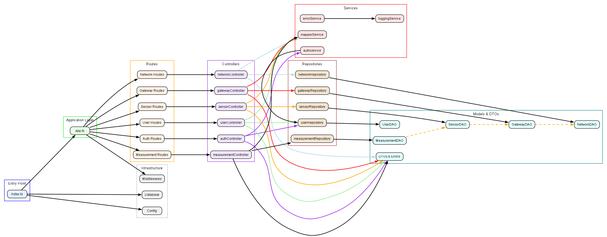
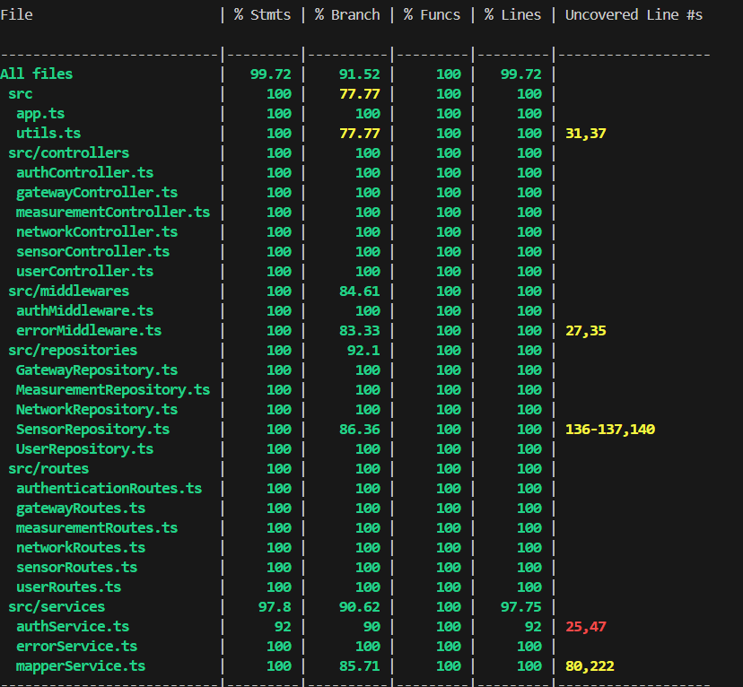

# Test Report

<The goal of this document is to explain how the application was tested, detailing how the test cases were defined and what they cover>

# Contents

- [Test Report](#test-report)
- [Contents](#contents)
- [Dependency graph](#dependency-graph)
- [Integration approach](#integration-approach)
- [Tests](#tests)
- [Coverage](#coverage)
  - [Coverage of FR](#coverage-of-fr)
  - [Coverage white box](#coverage-white-box)

# Dependency graph
  
### Project structure (dependency graph)

The simplified architecture of the project is organised in levels:
- **Entry Point**: `index.ts` starts the application and loads configurations/databases.
- **Application Layer**: `app.ts` manages the main routes (authentication, users, networks, gateways, sensors, measurements).
- **Controllers**: Handle HTTP requests and use services/repositories.
- **Services**: Business logic (e.g. `authService`, `mapperService`).
- **Repositories**: They interact with the **DAO** (data models) and the database.
- **Infrastructure**: Databases, configurations and middleware.

Dependencies are hierarchical:
`Routes → Controllers → (Services/Repositories) → DAO → Database`.  
The **DTOs** are shared between controllers for data management.  
Relationships between DAOs (e.g. `SensorDAO → GatewayDAO`) indicate links between entities.

# Integration approach

    <Write here the integration sequence you adopted, in general terms (top down, bottom up, mixed) and as sequence
    La strategia seguita per il testing di Gateway, Sensors e Measurements è stata bottom up, mentre per le Networks è stato seguito un approccio top down. Le varie parti sono state testate prima in modo indipendente, infine i vari test sono stati messi insieme.
    (ex: step1: unit A, step 2: unit A+B, step 3: unit A+B+C, etc)>

    Networks
    step1: e2e test, step2: routes integration test, step3: controllers integration test, step4: repository unit test

    Gateways
    step1: repository unit test, step2: controllers integration test, step3: routes integration test, step4: e2e test

    Sensors
    step1: repository unit test, step2: controllers integration test, step3: routes integration test, step4: e2e test

    Measurements
    step1: measurement repository unit test, step2: controllers integration test, step3: routes integration test, step4: e2e test

    Final Step: tutti i test sono stati inseriti in un'unica branch e provati tutti insieme

    Tutti i test unit e integration sono stati creati con l'utilizzo dei mock a eccezione dei measurement con cui è stato utilizzato anche il database, mentre per gli e2e è stato utilizzato un database di appoggio in modo da testare in modo più realistico possibile.

    <Some steps may  correspond to unit testing (ex step1 in ex above)>

    <One step will  correspond to API testing, or testing unit route.js>

# Tests

<in the table below list the test cases defined For each test report the object tested, the test level (API, integration, unit) and the technique used to define the test case (BB/ eq partitioning, BB/ boundary, WB/ statement coverage, etc)> <split the table if needed>

|                      Test case name                       |    Object(s) tested    | Test level  |    Technique used     |
| :-------------------------------------------------------: | :--------------------: | :---------: | :-------------------: |
|       create, get, delete User(success and errors)        |    User Repository     |    Unit     | WB/statement coverage |
|  create, get, update, delete Network(success and errors)  |   Network Repository   |    Unit     | WB/statement coverage |
|  create, get, update, delete Gateway(success and errors)  |   Gateway Repository   |    Unit     | WB/statement coverage |
|  create, get, update, delete Sensors(success and errors)  |   Sensors Repository   |    Unit     | WB/statement coverage |
|       create, get Measurements(success and errors)        | Measurement Repository |    Unit     | WB/statement coverage |
|       create, get, delete User(success and errors)        |    User Controller     | Integration | WB/statement coverage |
|  create, get, update, delete Network(success and errors)  |   Network Controller   | Integration | WB/statement coverage |
|  create, get, update, delete Gateway(success and errors)  |   Gateway Controller   | Integration | WB/statement coverage |
|  create, get, update, delete Sensors(success and errors)  |   Sensors Controller   | Integration | WB/statement coverage |
|             create, get, delete User(success)             |      User Routes       | Integration | BB/statement coverage |
|       create, get Measurements(success and errors)        | Measurement Controller | Integration | WB/statement coverage |
|       create, get, update, delete Network(success)        |     Network Routes     | Integration | BB/statement coverage |
|       create, get, update, delete Gateway(success)        |     Gateway Routes     | Integration | BB/statement coverage |
|       create, get, update, delete Sensors(success)        |     Sensors Routes     | Integration | BB/statement coverage |
|             create, get Measurements(success)             |   Measurement Routes   | Integration | BB/statement coverage |
|      create, get, delete User(errors 401, 403, 409)       |      User Routes       | Integration |  BB/eq partitioning   |
| create, get, update, delete Network(errors 401, 403, 409) |     Network Routes     | Integration |  BB/eq partitioning   |
| create, get, update, delete Gateway(errors 401, 403, 409) |     Gateway Routes     | Integration |  BB/eq partitioning   |
| create, get, update, delete Sensors(errors 401, 403, 409) |     Sensors Routes     | Integration |  BB/eq partitioning   |
|         create, get Measurements(errors 401, 403)         |   Measurement Routes   | Integration |  BB/eq partitioning   |
|         create, get, delete User(errors 404, 500)         |      User Routes       | Integration |      BB/boundary      |
|   create, get, update, delete Network(errors 404, 500)    |     Network Routes     | Integration |      BB/boundary      |
|   create, get, update, delete Gateway(errors 404, 500)    |     Gateway Routes     | Integration |      BB/boundary      |
|   create, get, update, delete Sensors(errors 404, 500)    |     Sensors Routes     | Integration |      BB/boundary      |
|         create, get Measurements(errors 404, 500)         |   Measurement Routes   | Integration |      BB/boundary      |
|             create, get, delete User(success)             |          User          |     e2e     | BB/statement coverage |
|       create, get, update, delete Network(success)        |        Network         |     e2e     | BB/statement coverage |
|       create, get, update, delete Gateway(success)        |        Gateway         |     e2e     | BB/statement coverage |
|       create, get, update, delete Sensors(success)        |        Sensors         |     e2e     | BB/statement coverage |
|             create, get Measurements(success)             |      Measurement       |     e2e     | BB/statement coverage |
|      create, get, delete User(errors 401, 403, 409)       |          User          |     e2e     |  BB/eq partitioning   |
| create, get, update, delete Network(errors 401, 403, 409) |        Network         |     e2e     |  BB/eq partitioning   |
| create, get, update, delete Gateway(errors 401, 403, 409) |        Gateway         |     e2e     |  BB/eq partitioning   |
| create, get, update, delete Sensors(errors 401, 403, 409) |        Sensors         |     e2e     |  BB/eq partitioning   |
|         create, get Measurements(errors 401, 403)         |      Measurement       |     e2e     |  BB/eq partitioning   |
|         create, get, delete User(errors 404, 500)         |          User          |     e2e     |      BB/boundary      |
|   create, get, update, delete Network(errors 404, 500)    |        Network         |     e2e     |      BB/boundary      |
|   create, get, update, delete Gateway(errors 404, 500)    |        Gateway         |     e2e     |      BB/boundary      |
|   create, get, update, delete Sensors(errors 404, 500)    |        Sensors         |     e2e     |      BB/boundary      |
|         create, get Measurements(errors 404, 500)         |      Measurement       |     e2e     |      BB/boundary      |

# Coverage

## Coverage of FR

<Report in the following table the coverage of functional requirements and scenarios(from official requirements) >

|                   Functional Requirement or scenario                   | Test(s) |
| :--------------------------------------------------------------------: | :-----: |
|                       FR1.1 : authenticate user                        |  100%   |
|                      FR2.1  : Retrieve all users                       |  100%   |
|                        FR2.2 Create a new user                         |  100%   |
|                     FR2.3 Retrieve a specific user                     |  100%   |
|                      FR2.4 Delete a specific user                      |  100%   |
|                      FR3.1 Retrieve all networks                       |  100%   |
|                       FR3.2 Create a new network                       |  100%   |
|                   FR3.3 Retrieve a specific network                    |  100%   |
|                         FR3.4 Update a network                         |  100%   |
|                    FR3.5 Delete a specific network                     |  100%   |
|                FR4.1 Retrieve all gateways of a network                |  100%   |
|                FR4.2 Create a new gateway for a network                |  100%   |
|                   FR4.3 Retrieve a specific gateway                    |  100%   |
|                         FR4.4 Update a gateway                         |  100%   |
|                    FR4.5 Delete a specific gateway                     |  100%   |
|                FR5.1 Retrieve all sensors of a gateway                 |  100%   |
|                FR5.2 Create a new sensor for a gateway                 |  100%   |
|                    FR5.3 Retrieve a specific sensor                    |  100%   |
|                         FR5.4 Update a sensor                          |  100%   |
|                     FR5.5 Delete a specific sensor                     |  100%   |
| FR6.1 Retrieve measurements for a set of sensors of a specific network |  100%   |
|  FR6.2 Retrieve statistics for a set of sensors of a specific network  |  100%   |
|   FR6.3 Retrieve outliers for a set of sensors of a specific network   |  100%   |
|             FR6.4 Store measurements for a specific sensor             |  100%   |
|           FR6.5 Retrieve measurements for a specific sensor            |  100%   |
|            FR6.6 Retrieve statistics for a specific sensor             |  100%   |
|             FR6.7 Retrieve outliers for a specific sensor              |  100%   |

## Coverage white box

Report here the screenshot of coverage values obtained with jest-- coverage

